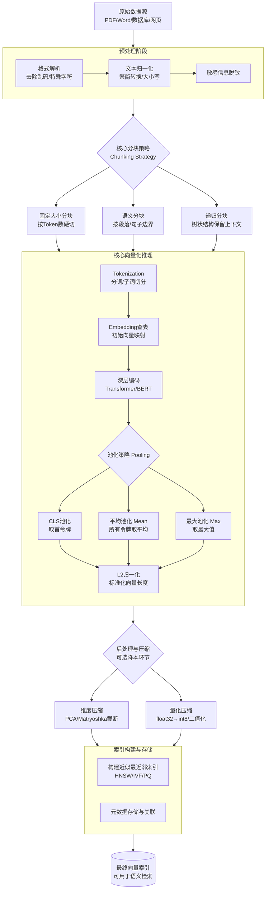

好的，已将索引相关内容融合到文档的**第四部分 4.2（5）索引构建**环节中。以下是完整更新后的文档：

---

# Embedding 技术全解析：从入门到精通

本指南系统性地整合了关于 Embedding（嵌入向量）技术的完整知识体系，涵盖基础概念、底层原理、主流算法、技术全景、工程实践及复杂场景处理。全文采用大量生活化类比，由浅入深，旨在构建系统化的认知框架。

## 第一部分：基础入门篇——什么是 Embedding？

### 1.1 核心定义

**Embedding（嵌入）** 是将人类可理解的非结构化数据（文字、图片、音频）转换为计算机可计算的**低维、稠密、连续**浮点数向量的过程。

打个比方：这就像给每个内容发了一张 **“数字身份证”** 。这张身份证不是简单的编号，而是一组有意义的数字，它们的位置和相互关系反映了原始内容的特征和含义。

### 1.2 为什么需要 Embedding？（对比 One-Hot）

传统 **One-Hot 编码** 就像给每个词发一个独立且互不相干的编号：

- **维度灾难**：词表有多大，向量就有多长。10万个词就是10万维。
- **语义鸿沟**：所有向量互相垂直（正交），“苹果”和“水果”的相似度是0，计算机认为它们毫无关系。
- **极度稀疏**：向量里绝大部分是0，信息密度极低。

而 **Embedding** 实现了革命性突破：

| 对比维度     | One-Hot 编码                      | Embedding                                    |
| :----------- | :-------------------------------- | :------------------------------------------- |
| **向量形态** | 高维稀疏（如50,000维，大部分是0） | 低维稠密（如384维，每个维度都有值）          |
| **语义关系** | 词与词之间独立无关                | 语义相近的词在空间中距离近                   |
| **能否计算** | 不能做有意义的数学运算            | 支持语义运算，如 `国王 - 男人 + 女人 ≈ 女王` |

### 1.3 核心应用场景

1. **语义搜索与 RAG（检索增强生成）** ：将用户问题和知识库文档都转换为向量，通过计算相似度找到语义匹配的内容，而非仅靠关键词。
2. **推荐系统**：用户向量和物品（电影、商品）向量在空间中距离越近，越可能喜欢。
3. **聚类与分类**：利用 K-Means 等算法自动将海量文本归类。
4. **异常检测**：异常数据（欺诈行为、违规内容）的向量会远离正常数据聚集区。
5. **跨模态检索**：CLIP 等模型可实现“以文搜图”、“以图搜文”。
6. **深度特征输入**：作为预训练特征输入下游机器学习模型，提升效果。

## 第二部分：核心原理——AI 是如何“学会”词义的？

第二部分回答两个核心问题：**① AI 怎么把“文字”对应到“数字”？② AI 是怎么通过训练让这些数字变“聪明”的？**

### 2.1 数学本质：f: V → ℝᵈ（HR 分配工位）

**一句话定义**：这是一个映射函数，保证**每个词（V）** 都能对应到一个**具体的数字坐标（ℝᵈ）**。

**通俗理解**：你入职一家新公司（AI模型），HR（映射函数）必须给你分配一个具体的工位号（向量坐标，比如 7-308）。这个工位号不是乱给的，**HR的原则是：让同一部门的同事工位挨在一起**（语义相近的词，向量距离近）。

计算机只认数字不认汉字，如果没有这个“工位号”，电脑就不知道“苹果”和“香蕉”原来都在“水果部”挨着坐。

### 2.2 工作流程

#### （1）前向传播（查表）-> “秘书按名单领人”

**一句话定义**：输入一个词ID，直接从巨大的词表矩阵里，把那一行的数字原封不动地复制出来。

**通俗理解**：老板（输入层）说：“去把‘苹果’叫来。”HR秘书（Embedding层）不干别的，只做一件事：翻开花名册（Embedding矩阵），找到“苹果”那一页，把上面写的工位号（比如 `[0.1, 0.2, -0.5]`）**抄在纸条上**交给老板。

**重点**：这个过程**没有任何计算**，纯属“复制粘贴”。Embedding层在推理时就是一本字典，谁来了就翻到哪一页。

#### （2）反向传播（稀疏更新）-> “只批评犯错的那个人”

**一句话定义**：训练时，模型把预测结果和正确答案比较，算出误差，然后修改 Embedding 矩阵里的数字。**但重点：只修改刚才被“查表”叫出来的那一行，没被叫到的词纹丝不动。**

**通俗理解（做菜调咸淡）** ：今天老板只点了“苹果”这道菜（输入）。大厨（模型）做好后尝了一口发现咸了（计算损失）。大厨会去改“苹果”的菜谱配方（更新向量），把盐减半。今天没被点到的“香蕉”、“汽车”的菜谱，大厨**看都不看一眼，完全不改**。

**为什么这很重要**：这就是Embedding能处理几十万词汇量的原因！如果每次训练都要把所有词的菜谱全改一遍，计算机早就累死机了。**用谁改谁（稀疏更新）** 让训练速度飞起。

### 2.3 核心算法三大流派（用“做菜”来区分）

| 算法流派                   | 做菜心态（训练方式）                                                                                                  | 最终成果                                                                           | 致命缺点                                                       |
| :------------------------- | :-------------------------------------------------------------------------------------------------------------------- | :--------------------------------------------------------------------------------- | :------------------------------------------------------------- |
| **Word2Vec （预测派）** | **“完形填空狂魔”** 。不看整本菜谱，只看**隔壁邻居**（滑动窗口）。如果“盐”经常挨着“糖”出现，就觉得这俩是兄弟。         | 像**压面机**，速度快，能做“国王-男人+女人≈女王”这类类比题。                        | **断章取义**。没看全文，不知道“苹果”在上下文里是水果还是手机。 |
| **GloVe （统计派）**    | **“大数据分析狂”** 。不看邻居，而是把厨房里**所有食材两两一起出现的总次数**拉一张巨型表格（共现矩阵），再压缩这张表。 | 像**精密天平**，稳重，掌握全局统计信息。                                           | **太死板**。只盯着总次数，还是读不懂带上下文的句子。           |
| **BERT （上下文派）**   | **“阅读理解大师”** 。不只看邻居，也不只看总次数，而是**把整句话从头到尾读一遍**，双向结合上下文来揣摩。               | 像**米其林大厨**，能“看人下菜碟”。看到“吃”就把苹果当水果，看到“买”就把苹果当手机。 | 成本太高，需要强大的GPU（超级厨房）才能运作。                  |

### 2.4 终极理解

1. **Embedding矩阵（HR花名册）** 刚开始全是乱填的数字（随机初始化）。
2. **前向传播（查表）** ：来了“苹果”，把那行乱填的数字抄出来。
3. **反向传播（改菜谱）** ：模型发现根据这行数字算出来的结果不对，于是**只把“苹果”这一行的数字调了调**。
4. 经过几亿次“查表 -> 改这一行 -> 查表 -> 改这一行”的循环，**这个矩阵里每一行的数字，就慢慢沉淀出了语义信息**，变得“聪明”了。

## 第三部分：主流技术类型（用“搬家打包”来理解）

这部分讲不同向量类型的区别，用**搬家整理物品**来类比：

### 3.1 五大技术类型详解

| 类型           | 核心算法           | 搬家类比                                                                                                                 | 适用场景                                     |
| :------------- | :----------------- | :----------------------------------------------------------------------------------------------------------------------- | :------------------------------------------- |
| **稀疏向量**   | TF-IDF, BM25       | **按标签分类归档**。每个文件盒贴一个具体标签（如“苹果”），搜“水果”找不到“苹果”盒子。几万个盒子堆满仓库（维度极高）。     | 专利检索、法律条文、版权查重（需要精准匹配） |
| **稠密向量**   | BGE, E5, OpenAI    | **画一张语义地图**。把“苹果”“香蕉”“橘子”画在左上角挨着，把“汽车”“飞机”画在右下角。搜“水果”时点左上角就能一网打尽。       | 语义搜索、RAG、智能客服（最通用）            |
| **量化向量**   | 训练后量化(PTQ)    | **真空压缩袋打包**。把蓬松羽绒服（float32）抽成薄片（int8）。体积变1/4，搬运速度翻倍，衣服有轻微折痕（精度微损）。       | 亿级大规模生产环境降本增效                   |
| **多向量**     | BGE-M3, ColBERT    | **给每件物品单独拍照**。不把厚书浓缩成一个点，而是每页拍张照（每个句子生成向量）。用户问细节能精准找到那一页。           | 高精度长文档RAG、医疗财报分析                |
| **Matryoshka** | Jina Embeddings v4 | **可折叠万能家具（俄罗斯套娃）** 。训练时保证前半截（如前128维）也能独立使用。卡车大用全尺寸，卡车小就截取前一半照样用。 | 多端部署（云端高维，移动端低维）             |

### 3.2 主流模型与框架

- **开源模型**：**BGE**（智源）、**E5**（微软）、**Qwen3-Embedding**（阿里）、**NV-Embed**（英伟达）。
- **商业 API**：**OpenAI text-embedding-3**（small 1536维 / large 3072维）、**Google Gemini Embedding**、**Voyage AI**。
- **开发框架**：**Sentence-Transformers**（最流行，封装池化层）、**Gensim**（传统词嵌入）、**LangChain**（统一接口集成）。

## 第四部分：向量化流程技术全景图（含全流程图）

向量化不仅仅是调用模型，而是一条包含预处理、分块、推理、压缩和索引的完整流水线。

### 4.1 向量化全流程技术全景图

### 4.2 关键环节精讲

#### （1）预处理与清洗（地基工程）

- **格式解析**：PDF/Word/HTML 提取纯文本。
- **文本归一化**：统一繁简体、全半角字符，去除控制字符。
- **敏感信息脱敏**：移除身份证号、手机号等。
- **关键陷阱**：**不要去除停用词**（如“的”“了”），现代Embedding模型依赖完整语序。

#### （2）分块策略（Chunking）—— RAG 成败的关键

| 分块类型         | 实现方式                                               | 优点             | 缺点               |
| :--------------- | :----------------------------------------------------- | :--------------- | :----------------- |
| **固定大小分块** | 按固定Token数（如256）硬切，可带重叠                   | 计算简单、极快   | 容易切断句子       |
| **语义分块**     | 按句号、段落、标题等自然边界切分                       | 保持完整语义单元 | 对无格式文本效果差 |
| **递归分块**     | 父块（大章节）包含子块（小段落），检索时找子块返回父块 | 保留长程上下文   | 实现复杂，存储翻倍 |

**实战铁律：修改分块策略带来的召回率提升，远比换一个大模型来得明显！**

#### （3）核心向量化推理

1. **Tokenization（分词）** ：把“我喜欢AI”变成 `[“我”，“喜欢”，“AI”]`。
2. **Embedding查表**：将每个Token映射为初始向量。
3. **深层编码（Transformer）** ：每个Token的向量融入左右上下文（“苹果”在此刻被赋予特定含义）。
4. **池化策略（Pooling）** ：将多Token矩阵压缩为单一向量。
   - **平均池化（Mean）** ：当前语义相似度任务**最主流方案**（E5/BGE），均匀吸收所有Token信息。
   - **CLS池化**：BERT系经典，取首位特殊令牌。
5. **L2归一化**：向量模长缩放到1，使余弦相似度等价于点积，加速检索。

**💡 池化与归一化的“人话”理解**：

- **平均池化 = “全班同学举手投票”**：把每个Token的意思听完后取平均数。**特别稳**，哪怕有一两个废话词也不影响整体意思。
- **CLS池化 = “只听班长的”**：只看开头第一个特殊符号。要是这个“班长”走神了，整篇总结就废了。
- **L2归一化 = “把所有尺子砍成一样长”**：强行把所有向量的长度都变成1。因为搜索时只关心“方向”（意思是否相近），不关心“长短”。砍齐后算起来快得像飞。

**给你的“抄作业”结论**：直接选 **“平均池化（Mean Pooling）” + “L2归一化（L2 Normalization）”** ，这是目前全球各大AI公司验证过的**“黄金搭档”**。

#### （4）后处理与压缩（降本增效）

- **维度裁剪（Matryoshka/PCA）** ：1536维截取前512维即可用。
- **量化压缩（PTQ）** ：float32 → int8，内存占用减少75%，精度损失通常<1%。

#### （5）索引构建（ANN）—— 让亿级数据毫秒级召回的核心

这是整个向量化流程的最后一公里，也是最容易让人迷糊的环节。咱们先搞懂它到底在解决什么问题。

**🔴 核心矛盾：暴力搜索为什么不行？**

假设你的向量数据库里有 **10亿条** 文本向量。用户搜一个问题，生成一个查询向量。

- **暴力办法（Flat）**：把10亿条全部遍历一遍，算一遍距离，再排序取Top10。**这得算到天荒地老**（几十秒甚至几分钟），线上服务直接超时崩掉。
- **向量索引的办法（ANN，近似最近邻）**：**提前建好“捷径”和“路标”**。用户提问时，不遍历全部，而是顺着路标快速跳过99.9%的数据，**只盯着最有可能的那几十上百条算距离**。耗时从“分钟级”降到“毫秒级”。

> **通俗定义**：向量索引本质上是一种**“近似最近邻（ANN）”搜索**。它牺牲一点点精度（比如漏掉1%的真正答案），换取速度提升上千倍。

**🔵 主流算法的实现原理（用“找人”彻底搞懂）**

| 算法                | 找人的类比                                                                                                                                                                         | 一句话原理                                                            |
| :------------------ | :--------------------------------------------------------------------------------------------------------------------------------------------------------------------------------- | :-------------------------------------------------------------------- |
| **IVF（倒排索引）** | **先按小区划分，再入户找人**。建索引时用K-Means把10亿个向量分成1万个“簇”（小区），每个簇有个中心点（小区大门）。查询时先算离哪个小区大门最近，选中3个后只在这3个小区里挨家挨户找。 | 聚类分区，**先粗筛再精排**。搜索量从10亿降到3万。                     |
| **HNSW（分层图）**  | **先上高速，再下国道，最后进胡同**。建索引时画一张多层跳跳棋地图，顶层只有几个超级节点（高速路），最底层是所有数据（胡同）。查询时从顶层快速跳到最近节点，逐层下钻到底层。         | 多层跳表结构，**逐层逼近**。查询极快，精度极高。                      |
| **PQ（乘积量化）**  | **给向量做缩写代号，用查代号替代算距离**。把一个长向量（如1536维）切成8段，每段单独压缩成256类之一，编个号（占1字节）。查询时也切段，直接查编号表读出预计算的距离，8段加起来就行。 | 向量压缩 + **查表代替计算**。计算量从1536次浮点乘法降到8次查表+加法。 |

**🟢 工作流程（分两阶段）**

- **建索引（离线，只做一次）**：全量向量灌入 → 训练分区/码本（K-Means聚类） → 分配每条向量到对应簇或压缩成编码 → 存成索引文件。
- **查索引（在线，实时做）**：查询向量进入 → **粗筛**：快速计算到所有簇中心或顶层节点的距离，圈定几百个候选 → **精排**：只对这几十上百个候选做全精度距离计算 → 输出Top-K。

**🟡 与 SQL 索引（如 B-Tree）的核心差异**

| 对比维度         | **SQL索引**                                                             | **向量索引**                                                   |
| :--------------- | :---------------------------------------------------------------------- | :------------------------------------------------------------- |
| **生活类比**     | **新华字典拼音查字**。查“zhang”直接翻到那页，**精准命中**。             | **找和自己长得像的人**。先把人按长相分大区，只看最像的那个区。 |
| **查询目标**     | **精确匹配**（`where id=123`）或**范围查询**（`age between 18 and 25`） | **近似最近邻**（`找到离我最近的10个邻居`）                     |
| **数据结构**     | **树状结构**（B-Tree/B+Tree），数据严格有序（一维）                     | **图结构 + 聚类 + 压缩码**，数据高维，没有全局顺序             |
| **是否牺牲精度** | **零精度损失**，绝对正确                                                | **必有精度损失（近似）**，故意漏掉极少数换取速度               |
| **核心瓶颈**     | **磁盘IO**（读盘速度）                                                  | **CPU算力（浮点乘法）+ 内存带宽**（搬向量太贵）                |

> **一句话总结**：SQL索引为了“找到相等的”，精度必须100%；向量索引为了“找到最像的”，允许漏掉1%，但必须快如闪电。

**🔴 工业界的“黄金组合拳”**

生产环境中，**不会只用一个，而是组合使用**：

- **IVF + PQ（最经典）**：IVF负责分区（告诉你该去哪个小区找），PQ负责压缩（内存直降75%）。查询时先拿IVF圈定候选簇，再在这几个簇里用PQ快速算距离，最后拿几十个候选做全精度Re-rank。
- **HNSW + SQ（标量量化）**：内存够大时用，精度极高、速度最快，但建索引慢（适合读多写少的场景）。

**🟣 给你的“选型抄作业”**

| 你的数据量         | 硬件情况            | 闭眼选的组合                                       |
| :----------------- | :------------------ | :------------------------------------------------- |
| 少于100万条        | 内存随便用（>32GB） | **暴力搜索（Flat）** ，别整花活，精度最高          |
| 100万 ~ 1亿条      | 内存有限（16~64GB） | **IVF + PQ**，经典组合，内存友好                   |
| 1亿以上，QPS极高   | 内存充足（>128GB）  | **HNSW + SQ**，查询极快，精度损失极小              |
| 超大规模（10亿级） | 内存捉襟见肘        | **IVF + PQ + GPU加速**，或用云厂商分布式向量数据库 |

## 第五部分：复杂文档场景处理（进阶实战）

针对 PDF 双栏排版、扫描件模糊、表格公式、图文混排等复杂情况，需采用 **“先理解结构，再智能分块”** 的策略。

### 5.1 处理流水线

1. **文档解析**：弃用 `PyPDF2`，改用 **MinerU**、**Docling**、**Unstructured.io**，输出结构化 Markdown/JSON，还原阅读顺序。
2. **版面分析**：提取层级树（标题/段落/表格/图片）及空间坐标（边界框）。
3. **精细化分块**：

| 复杂场景           | 处理策略                                          |
| :----------------- | :------------------------------------------------ |
| **双栏/多栏排版**  | 利用解析器按正确阅读顺序重排，或按栏裁剪后分别OCR |
| **表格**           | 转为HTML/Markdown保留结构；行组切分并重复表头     |
| **公式**           | 采用Pix2Text或专业解析器转换为LaTeX格式           |
| **图片/老旧照片**  | 图像预处理（二值化、降噪、去印章）+ PaddleOCR识别 |
| **中英文混合**     | 使用智能识别中英文标点和分词规则的切分工具        |
| **PDF模糊/扫描件** | 图像预处理（二值化、降噪、角度矫正）+ OCR         |
| **代码块**         | 保留Markdown标记，确保完整不被截断                |
| **页眉页脚/脚注**  | 识别并标记，分块时剔除或单独处理                  |

### 5.2 推荐工具

- **全能型**：MinerU、Docling、Unstructured.io
- **云端服务**：阿里云文档智能（Document Mind）
- **开源工具**：DeepDoc、ZhDocParser
- **OCR引擎**：Tesseract、PaddleOCR、CnOCR/Pix2Text

**核心理念**：理想的分块**不是对文本的物理分割，而是对文档逻辑单元的语义提取**。

## 第六部分：概念澄清与总结

### 6.1 向量化 vs Embedding

| 对比维度       | 向量化（Vectorization）      | Embedding（嵌入）                                        |
| :------------- | :--------------------------- | :------------------------------------------------------- |
| **技术范畴**   | 广义的**数学过程**（如何转） | 特指通过**神经网络学习**得到的**语义产物**（转成什么样） |
| **是否含语义** | 不一定。仅表示数值化         | **必须含语义**。相似的词向量距离近                       |
| **向量形态**   | 高维、极度稀疏（如50,000维） | 低维、稠密（如384维、1536维）                            |
| **生成方式**   | 基于规则统计（TF-IDF计数）   | 基于**数据驱动**的神经网络训练                           |

**关系**：**Embedding 是向量化的高级子集**。所有Embedding都是向量，但非所有向量都是Embedding。在当今RAG语境下两者常被混用，因为实际使用的都是Embedding模型。

### 6.2 Embedding 包含的四层内容

| 层次       | 具体包含内容                                            | 通俗理解                   |
| :--------- | :------------------------------------------------------ | :------------------------- |
| **数据层** | 浮点数数组 + 维度（如1536维）+ 数据类型（float32/int8） | 车的载重量和尺寸           |
| **模型层** | 分词器 + 多层Transformer权重 + 池化策略                 | 造车的工厂和蓝图           |
| **语义层** | 上下文含义、句法结构、共现关系、类比逻辑                | 车里面拉的高级货物（语义） |
| **工程层** | 原始文本 + 元数据 + 多粒度副本 + 索引结构               | 车牌号、货单和停车场地图   |

### 6.3 终极总结

Embedding 技术实现了从离散符号到连续语义空间的映射。在现代 AI 架构中，**Embedding 是一种“中间态”的通用语言**，它将所有复杂的业务问题（搜索、推荐、分类、生成）统一化简为**向量空间中的数学计算**（距离远近与夹角大小）。

**掌握从预处理、分块、模型选型、向量化到索引构建的全链路知识，是构建高质量 RAG 及语义搜索系统的基石。**

## 参考文档

以下是文档中提到的关键模型、算法和工具的官方参考链接，按类别整理如下：

---

### 一、经典 Embedding 模型论文

| 模型         | 参考链接                                                                                                      |
| :----------- | :------------------------------------------------------------------------------------------------------------ |
| **Word2Vec** | 官方项目：https://code.google.com/p/word2vec/                                                                 |
| **GloVe**    | 论文（EMNLP 2014）：https://aclanthology.org/D14-1162/  项目主页：https://nlp.stanford.edu/projects/glove/ |
| **BERT**     | 论文（arXiv 1810.04805）：https://arxiv.org/abs/1810.04805                                                    |

---

### 二、现代开源 Embedding 模型

| 模型                   | 参考链接                                                                                                                                                                                                                    |
| :--------------------- | :-------------------------------------------------------------------------------------------------------------------------------------------------------------------------------------------------------------------------- |
| **BGE（智源）**        | 论文：https://arxiv.org/abs/2502.11431  GitHub：https://github.com/FlagOpen/FlagEmbedding  模型地址：https://huggingface.co/BAAI                                                                                      |
| **BGE-M3**             | 论文：https://arxiv.org/abs/2402.03216  模型地址：https://huggingface.co/BAAI/bge-m3                                                                                                                                     |
| **E5（微软）**         | 论文：https://ar5iv.labs.arxiv.org/html/2212.03533  GitHub：https://github.com/microsoft/unilm/tree/master/e5                                                                                                            |
| **Jina Embeddings v4** | 发布公告：https://jina.ai/news/jina-embeddings-v4-universal-embeddings-for-multimodal-multilingual-retrieval/  技术报告：https://arxiv.org/abs/2506.18902  模型地址：https://huggingface.co/jinaai/jina-embeddings-v4 |
| **ColBERT**            | 论文（SIGIR 2020）：https://arxiv.org/abs/2004.12832  GitHub：https://github.com/stanford-futuredata/ColBERT                                                                                                             |
| **Sentence-BERT**      | 论文（EMNLP 2019）：https://arxiv.org/abs/1908.10084  ACL 版本：https://aclanthology.org/D19-1410/                                                                                                                       |

---

### 三、商业 API 模型

| 模型                        | 参考链接                                                                                                                                                                         |
| :-------------------------- | :------------------------------------------------------------------------------------------------------------------------------------------------------------------------------- |
| **OpenAI text-embedding-3** | 发布公告：https://openai.com/blog/new-embedding-models-and-api-updates  开发者文档：https://platform.openai.com/docs/guides/embeddings  帮助中心：https://help.openai.com/ |

---

### 四、向量索引算法

| 算法                | 参考链接                                                       |
| :------------------ | :------------------------------------------------------------- |
| **HNSW**            | 论文（arXiv 1603.09320）：https://arxiv.org/pdf/1603.09320.pdf |
| **IVF（倒排索引）** | 相关论文（示例）：https://arxiv.org/abs/2405.13986             |
| **PQ（乘积量化）**  | 原始 PQ 论文：Jegou et al., 2011，IEEE TPAMI                   |

---

### 五、文档解析工具

| 工具                | 参考链接                                                                                      |
| :------------------ | :-------------------------------------------------------------------------------------------- |
| **MinerU**          | 官网：https://mineru.net  GitHub：https://github.com/opendatalab/MinerU-Ecosystem          |
| **Docling**         | GitHub：https://github.com/docling-project/docling  论文：https://arxiv.org/abs/2406.12526 |
| **Unstructured.io** | 官方文档：https://docs.unstructured.io                                                        |

---

### 六、OCR 引擎

| 工具          | 参考链接                                                                             |
| :------------ | :----------------------------------------------------------------------------------- |
| **PaddleOCR** | 官网：https://www.paddleocr.ai  GitHub：https://github.com/PaddlePaddle/PaddleOCR |

---

### 七、权威评测基准

| 评测基准        | 参考链接                                                                                       |
| :-------------- | :--------------------------------------------------------------------------------------------- |
| **MTEB 排行榜** | https://huggingface.co/spaces/mteb/leaderboard  MTEB 论文：https://arxiv.org/abs/2210.07316 |
