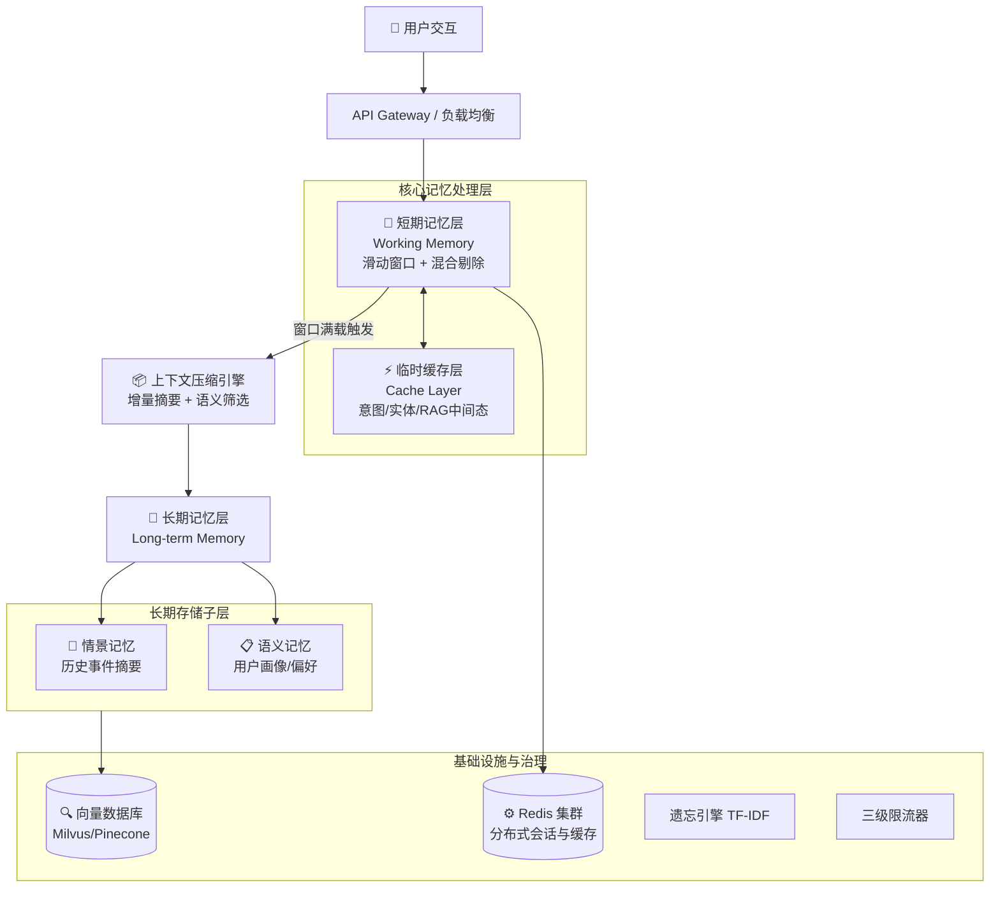
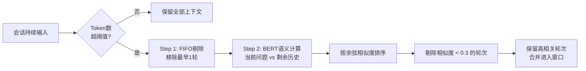
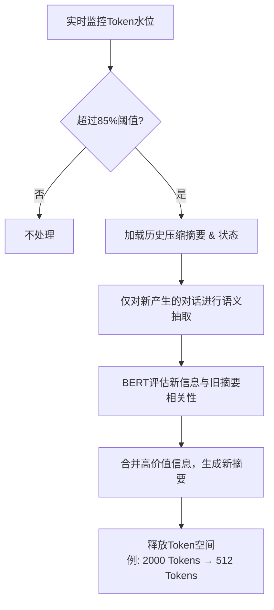
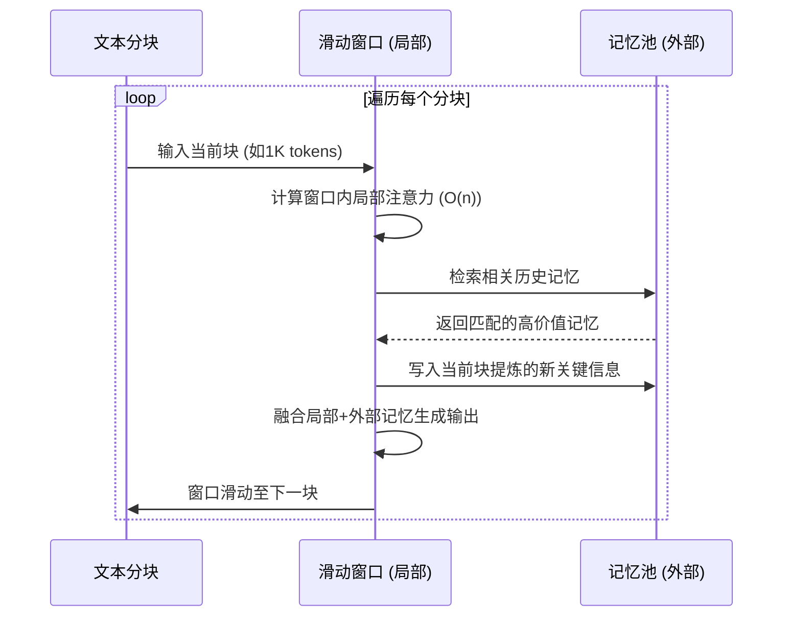

# 大模型会话记忆系统
**基于 DeepSeek 架构、商业化实践与前沿探索**
**版本**：v3.0（终极整合版） | **更新日期**：2026年7月24日

---

## 第一部分：商业哲学与总体架构

### 1.1 核心商业命题
大模型的会话记忆设计已从简单的"历史消息存储"演进为支撑商业化落地的核心基础设施。其根本目标是在**成本（Cost）、体验（Experience）、隐私（Privacy）** 三元悖论中寻找帕累托最优解。
- **商业价值量化**：良好的记忆设计可使多轮对话Token消耗下降**97%**（通过上下文压缩与缓存），将AI从"一次性工具"进化为"长期伙伴"，直接提升用户生命周期价值（LTV）并降低运营成本。

### 1.2 总体系统架构图
系统采用**分层解耦**设计，包含短期工作记忆、长期持久化记忆、临时缓存及分布式基础设施四大块。



---

## 第二部分：四大核心层级深度解析

### 2.1 短期记忆层 (Working Memory)
**定位**：当前会话的实时上下文，保证多轮对话的连贯性。

| 属性               | 技术规格                                                |
| :----------------- | :------------------------------------------------------ |
| **存储介质**       | Redis (内存数据库)，延迟 < 1ms                          |
| **窗口大小**       | 默认保留最近 **5~9 轮**（经A/B测试最优平衡点）          |
| **生命周期 (TTL)** | 默认 **15~30 分钟**无交互即过期（基于`lastAccessedAt`） |

**核心机制：混合剔除策略（FIFO + 语义相似度）**
当超过窗口阈值时，并非简单先进先出，而是采用两步走：
1. **队列保底（FIFO）**：移除最早轮次，守住成本底线。
2. **语义择优（BERT）**：使用 Sentence-BERT 计算当前问题与候选池历史的**余弦相似度**，优先剔除相似度低于阈值（如 0.3）的低价值轮次，防止主题漂移。

**剔除决策流程图：**


### 2.2 长期记忆层 (Long-term Memory)
**定位**：跨会话的知识保留，实现"越用越懂你"。存储于向量数据库或知识图谱。

| 子类型       | 核心定义                             | 技术流程                                                                                                   |
| :----------- | :----------------------------------- | :--------------------------------------------------------------------------------------------------------- |
| **情景记忆** | **"记事儿"**：具体的历史交互事件。   | **摘要→向量化**：会话结束时，LLM蒸馏为文本摘要 → Embedding模型向量化 → 存入向量库；新会话按语义检索召回。  |
| **语义记忆** | **"学知识"**：提炼的抽象事实与偏好。 | **分析→提炼→更新**：定期离线分析历史（含情景摘要）→ 提取稳定模式（如"偏好Python"）→ 构建结构化画像持久化。 |

### 2.3 临时缓存层 (Cache Layer)
**定位**：大模型推理流水线的"预制件仓库"。存**中间计算结果**，非最终答案。
- **存储内容**：意图识别结果（`intent:weather`）、实体（`city:Beijing`）、RAG检索片段。
- **技术选型**：Redis（延迟 0.1~1ms，远快于磁盘/向量库的50ms+）。
- **商业价值**：连续追问（"北京天气"→"那后天呢"）直接命中缓存意图，**跳过重复计算**。
- **生命周期**：TTL设置 **30秒~5分钟**，极短以防止话题突变导致意图冲突。

### 2.4 分布式会话存储
**定位**：支撑高并发、高可用的"神经系统"。
- **核心能力**：1) **高可用**：节点宕机时自动故障转移，用户无感知；2) **水平扩展**：新节点随时接入；3) **负载均衡**：破除"会话粘滞"，请求任意分发。
- **实现**：基于 **Redis集群** + Session ID，冷热数据分层（热数据Redis，冷数据S3）。

---

## 第三部分：记忆全生命周期管理机制

### 3.1 上下文压缩 (增量式摘要)
**触发条件**：Token消耗逼近窗口上限（如85K）。
**核心流程图：**


### 3.2 动态注意力与记忆池 (DAA)
**针对超长文本（如10万Token）推理优化，信息保留率从37%提升至89%。**
**核心流程交互图：**


### 3.3 遗忘机制 (TF-IDF 智能信息筛选)
**不按时间，而按"信息含量（独特性）"剔除。**
**决策树流程：**
```mermaid
flowchart TD
    A[窗口即将满载] --> B[以单轮问答为单元分割]
    B --> C[计算每轮文本的 TF-IDF 分数]
    C --> D[引入时间衰减: 最终分 = TF-IDF × (1 + 近因奖励)]
    D --> E[按最终分从低到高排序]
    E --> F{分数极低?<br>如 <0.1}
    F -- 是 --> G[直接剔除轮次<br>如"好的""谢谢"]
    F -- 否 --> H{高分但较老?}
    H -- 是 --> I[触发压缩, 精炼为摘要保留]
    H -- 否 --> J[完整保留]
    I --> K[释放Token, 降本15%~20%]
    G --> K
```
**商业价值**：FIFO会因闲聊挤掉关键报错信息；TF-IDF精准保留"Error 404"等高密度术语，剔除废话。

### 3.4 会话过期机制
**定义**：基于"不活跃时间"的服务器自动清理（**非**用户关闭窗口）。
- 机制：`最后活动时间` 倒计时，若用户在TTL内发送新消息则计时器归零重置。
- 过期即销毁Redis会话数据，释放内存。

---

## 第四部分：交互体验与隐私前沿

### 4.1 流式响应与三级限流
DeepSeek 支持 **SSE** (Web端) 和 **WebSocket** (复杂交互) 流式传输，将首字延迟降低 **60%**。

**三级限流架构图：**
```mermaid
flowchart TD
    Request[用户请求] --> L1{第一级: 用户级限流<br>令牌桶算法 (QPS/并发)}
    L1 -- 超限 (429) --> Reject1[拒绝]
    L1 -- 通过 --> L2{第二级: 会话级限流<br>单Session并发 ≤ 3}
    L2 -- 超限 --> Reject2[排队/等待]
    L2 -- 通过 --> L3{第三级: 系统级优雅降级<br>自适应熔断器}
    L3 -- 错误率>15% --> Degrade[降级: 简化模型/缓存响应]
    L3 -- 正常 --> Backend[接入后端推理引擎]
```

### 4.2 隐私与去中心化记忆（探索方向）
**核心思想**：用轻量级"**人格向量 (Persona Vector)**"替代原始对话日志存储（社区提案，未上线）。

**人格向量工作流与数据主权：**
```mermaid
flowchart LR
    subgraph Client [🧑 用户设备 (本地)]
        A[原始对话] --> B[会话结束触发]
        B --> C[蒸馏: 提取人格向量<br>≤200 Tokens]
        C --> D[🔒 本地对称加密<br>密钥永不上传]
        D --> E[用户可随时查看/编辑<br>向量内容]
    end
    
    subgraph Server [☁️ DeepSeek 云端]
        F[收到加密向量] --> G[临时解密处理]
        G --> H[生成个性化响应]
        H --> I[🔄 立即删除向量<br>不做持久化存储]
    end
    
    E -.->|用户手动授权分享| F
```

---

## 第五部分：会话切换策略与权威参考文献

### 5.1 话题切换最佳实践
同一Session切换话题（A→B），**严禁依赖模型自动识别**。
| 策略                      | 操作方式                        | 成本效益                      |
| :------------------------ | :------------------------------ | :---------------------------- |
| **手动硬重置 (推荐)**     | 输入"忽略上文，开始新话题"      | 成本最低，利用指令覆盖旧权重  |
| **开发者新建会话 (最优)** | API调用生成**全新Session ID**   | **节省30%~50%** 无效Token消耗 |
| **系统软隔离**            | System Prompt预设关键词触发归档 | 用户体验平滑，需额外开发      |

### 5.2 权威参考文献索引
- **宏观综述**：*Memory for Autonomous LLM Agents* (arXiv), *RAG-Driven Memory* (IEEE Access), *Awesome-AI Memory* (TMLR)。
- **特定技术**：*ENGRAM* (轻量级SOTA, 超全基线15%)，*TraceMem* (叙事性图式), *Redis as agent memory* (官方指南)。
- **DeepSeek前沿**：*Conditional Memory via Scalable Lookup* (Engram模块, O(1)查找), *FlashMemory-DeepSeek-V4* (LSA前瞻稀疏注意力)。

---

## 第六部分：总结——技术哲学

DeepSeek的记忆系统设计体现了一套成熟的商业化工程哲学：

1. **分层解耦与存算分离**：精确控制每一分成本，通过冷热数据分层将基础设施开销最小化。
2. **智能降本 (AI Ops)**：通过TF-IDF遗忘机制和DAA注意力优化，在保证体验的前提下将单位会话算力成本压缩到极致。
3. **数据主权优先**：探索去中心化Persona Vector，从架构层面解决GDPR/CCPA合规问题，构建信任壁垒。
4. **体验驱动留存**：通过流式响应降低等待焦虑，通过语义记忆构建"专属伙伴"认知，提升付费转化率。