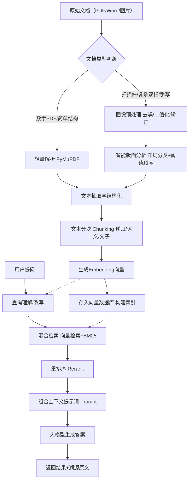
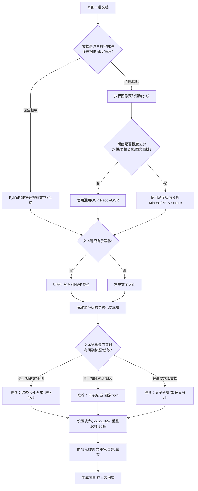
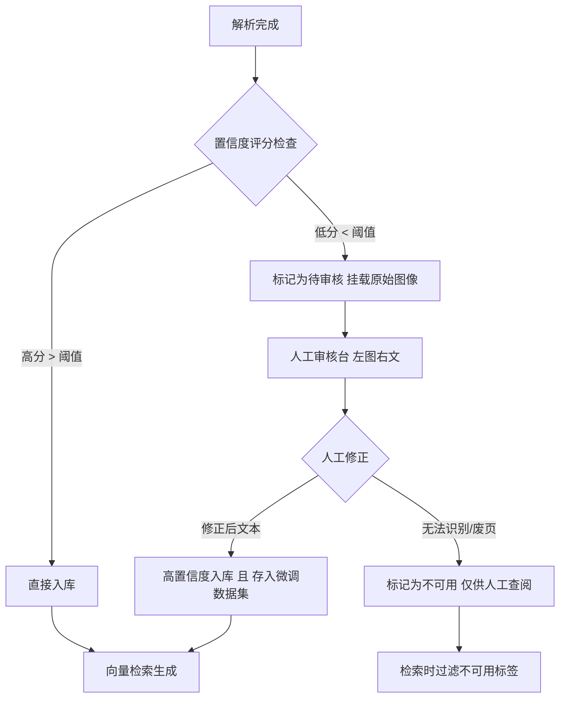

# RAG 完全指南：从原理到复杂文档落地的全流程剖析

> 本文基于此前多轮深度对话整理而成，系统整合了 RAG 的基础概念、核心算法、高阶架构、**文本分块（Chunking）的完整方法论**，以及**复杂文档解析（含手写/老旧图片/双栏排版）的生产级解决方案**。全文由浅入深，力求无遗漏、可落地。

**适合读者**：无大模型背景的小白 → 想深挖分块与文档处理的算法工程师 → 准备上线的技术决策者。

## 第一部分：RAG 是什么？（入门篇）

### 1.1 核心思想（一句话 + 一个故事）

**RAG = 检索（Retrieval）+ 增强（Augmented）+ 生成（Generation）**。
通俗地说，就是**先让 AI 去资料库里翻书，翻到相关段落，再照着书上的内容回答问题**。

> **故事场景**：公司新招了一个“超级学霸”助理（大模型），他什么都懂，但不知道公司内部新品政策。RAG 给他配了一个“资料管理员”（检索器），每次提问，管理员先去内部文档翻出相关几页，助理看完这几页再回答。既避免了胡说八道（幻觉），又能实时跟上业务变化。

### 1.2 为什么必须用 RAG？（解决三大致命伤）

| 大模型原生问题                         | RAG 解决方案                       |
| :------------------------------------- | :--------------------------------- |
| **知识过时**（训练截止后的事一概不知） | 实时检索最新文档库                 |
| **幻觉**（不懂就编）                   | 强制基于检索到的资料生成，不得臆造 |
| **缺乏私域知识**（不懂公司内部规程）   | 挂载企业内部知识库                 |

### 1.3 整体架构（离线 + 在线）

- **离线阶段（数据准备）** ：原始文档 → **文档解析**（含复杂排版/OCR）→ **文本分块（Chunking）** → 向量化（Embedding）→ 存入向量数据库。
- **在线阶段（问答检索）** ：用户提问 → 问题向量化 → 向量检索（+ 关键词检索）→ 重排序（Rerank）→ 组合提示词（Prompt）→ 大模型生成答案。

## 第二部分：RAG 核心算法与高阶进化（进阶篇）

### 2.1 检索侧核心算法（通俗拆解）

- **向量检索（语义匹配）** ：将文本翻译成高维数字向量，用**余弦相似度**找“意思相近”的段落。海量数据下用 **HNSW**（分层可导航小世界）算法做近似检索，牺牲极少精度换百倍速度。
- **BM25（关键词精确匹配）** ：
  - **三大法则**：①词频越高分越高，但有“饱和”天花板（防刷词）；②稀有词权重高（逆文档频率 IDF）；③**短文档匹配更值钱**（对长文档有长度惩罚）。
  - **在 RAG 中的角色**：充当“钢铁直男”，专抓用户问题里的精确字符串（如合同编号“XZ-2024-001”），弥补向量检索“语义漂移”的短板。
- **混合检索**：向量检索（语义） + BM25（关键词）结果融合（常用 RRF 算法），取长补短，**生产标配**。

### 2.2 四种高阶 RAG 架构（什么时候用？）

| 高阶类型        | 核心要解决什么问题                               | 一句话人设                                    | 代价 / 坑                    |
| :-------------- | :----------------------------------------------- | :-------------------------------------------- | :--------------------------- |
| **LongRAG**     | 切片太碎，丢失长上下文                           | “我直接把整章整节喂给 AI”                     | 成本贵、速度慢（吃 Token）   |
| **Self-RAG**    | 无脑检索、乱用无关资料                           | “检索前我先问自己三遍需不需要、有没有用”      | 推理变慢，吃模型逻辑能力     |
| **GraphRAG**    | 查不出多跳复杂关系（如“A 公司老板的老婆开的车”） | “我手里有张人物/事物关系地图，顺着关系跳着走” | 建图极度烧钱（LLM 抽关系）   |
| **Agentic RAG** | 只能单轮问答，做不了复杂调研任务                 | “我是特工队长，自己规划步骤、调工具、写报告”  | 最贵，易死循环，需设最大步数 |

**工业界落地的务实顺序**：先上基础 RAG + 混合检索（解决 70% 场景）→ 遇到上下文断裂，先调大分块（往 LongRAG 靠，0 成本）→ 遇到多跳，先试查询改写（不行再上 Graph）→ 最后才考虑 Agentic。

## 第三部分：重中之重 —— 文本分块（Chunking）全方位详解

> 业内共识：**RAG 效果 70% 取决于检索，检索的根基是分块**。块太大，信息稀释，检索不准；块太小，语义断裂，生成不通顺。

### 3.1 核心参数（必须理解）

- **Chunk Size（块大小）** ：每块含多少字符 / Token。
- **Chunk Overlap（重叠窗口）** ：相邻块重叠多少（通常设 10%~20%）。**作用**：防止关键信息刚好被切在边界上，确保至少在一个块内完整。

### 3.2 八大分块策略深度对比（含优劣与场景）

| 策略               | 核心做法                                                            | 优点                                   | 致命缺点                                      | 适用场景                     |
| :----------------- | :------------------------------------------------------------------ | :------------------------------------- | :-------------------------------------------- | :--------------------------- |
| **① 固定大小分块** | 按固定字符数硬切（如 512 Token）                                    | 极简、极快、成本可控                   | 在句子/词语中间乱切，语义破坏最大             | 快速原型验证、纯日志文件     |
| **② 句子级分块**   | 用 NLP 工具（如 spaCy）按句子边界切，N 句一组                       | 保持句子完整                           | 跨句上下文（代词指代）丢失，块太短            | FAQ、客服对话                |
| **③ 递归分块 ⭐**   | 按 `段落 → 句子 → 词` 优先级递归切，直到满足大小                    | **尽可能保留层级语义**，适应性极强     | 比固定分块略复杂                              | **通用生产首选（基线）**     |
| **④ 语义分块**     | 计算句子 Embedding 相似度，低于阈值时切分                           | 主题内聚性最强，逻辑连贯               | **计算成本极高**（每个句子过 Embedding 模型） | 土豪项目、对质量要求极致     |
| **⑤ 结构化分块**   | 利用文档显式结构（标题层级、表格、代码块、PDF 书签）                | 完美贴合逻辑，可溯源性强               | 强依赖文档格式，通用性弱                      | 法律合同、学术论文、技术手册 |
| **⑥ 父子分块**     | 建两层索引：大父块（上下文） + 小子块（检索命中），命中子块返回父块 | **找得准（细粒度）+ 看得全（粗粒度）** | 索引复杂，存储翻倍                            | 长文档精准问答               |
| **⑦ 延迟分块**     | 全文先生成 Embedding，再对向量序列切分                              | 保留全文语境做向量                     | 技术新，生产不普及                            | 前沿探索                     |
| **⑧ 智能体分块**   | Agent 理解任务后，自适应提取相关片段                                | 灵活性最高，针对任务定制               | 极其复杂，成本天价                            | 特定高价值科研任务           |

### 3.3 不同场景的选型决策矩阵（速查表）

| 你的文档长什么样                       | 无脑首选策略             | 推荐块大小       | 推荐重叠    |
| :------------------------------------- | :----------------------- | :--------------- | :---------- |
| 完全没结构（日志、纯文本）             | 固定大小 或 递归         | 256-512          | 10%         |
| **有段落章节（通用文章、博客、报告）** | **递归分块（强烈推荐）** | **512 Token**    | **10%-15%** |
| 有明确标题层级（标书、论文）           | 结构化分块               | 按章节/小节      | 10%-15%     |
| 代码                                   | AST 解析（按函数/类）    | N/A              | 0           |
| Markdown / HTML                        | 解析标题标签的结构化分块 | 按标题层级       | 10%-15%     |
| **质量要求极高 + 预算宽裕**            | **语义分块**             | 依边界动态       | N/A         |
| **超长文档 + 需要精确定位细节**        | **父子分块**             | 子 256 / 父 2048 | 10%         |

### 3.4 分块中的“七大深坑”与避坑指南

- **坑 1**：句子中间硬切 → 导致 Embedding 成噪声 → **解法**：弃用纯固定分块，至少用递归。
- **坑 2**：定义与术语被拆散（如“RAG”和“检索增强生成”分家）→ **解法**：用语义分块或加大重叠。
- **坑 3**：表格表头和数据分离 → **解法**：结构化分块，表格整体保留。
- **坑 4**：代码注释与函数体脱节 → **解法**：AST 解析，按函数边界。
- **坑 5**：块太大，一个块混入多个主题 → **解法**：调小块大小，或用语义切分。
- **坑 6**：重叠过大（如 50%）导致存储爆炸、检索变慢 → **解法**：严格控制在 20% 以内。
- **坑 7**：改了分块策略忘了重建索引 → **解法**：**铁律 —— 改分块必重建向量库**。

### 3.5 生产级分块调优七步流程（黄金 SOP）

1. **数据摸底**：统计文档格式（PDF/Word/代码）、结构复杂度、用户典型查询类型（长/短、精确/模糊）。
2. **选型基线**：不知道选啥就上 **递归分块（512 Token / 重叠 10%）** 。
3. **构建黄金评估集**：准备 **50~100 个真实用户问题** 及对应标准答案（必须真实，不可伪造）。
4. **A/B 测试**：在同一批数据上对比不同策略的 **Context Recall（相关块召回率）** 和 **Faithfulness（答案忠实度）** 。
5. **参数遍历**：在 256~2048 Token 区间、10%~20% 重叠区间做网格搜索（Grid Search），**用数据说话**。
6. **元数据注入**：给每个块打上 `<filename>`、`<chapter>`、`<page>`、`<timestamp>` 标签。检索时按元数据过滤，精度可从 73% 飙升至 82% 以上。
7. **持续监控**：上线后定期抽样 Bad Case，回灌至评估集，迭代下一轮优化。

## 第四部分：直面“地狱级”文档 —— 双栏、图文混排、老旧手写图片的全套解法

当文档不是规整的现代 Word，而是扫描 PDF、双栏排版、图片悬浮、坐标错位、甚至 80 年代手写纸质件时，常规分块直接失效。以下是**从识别到人工兜底**的五层生产流水线。

### 4.1 第一层：图像预处理（“洗照片”）

老旧图片必须先做“整形手术”，否则 OCR 全是乱码：

- **去噪**：去除纸张泛黄、霉点、扫描杂质（如 `cv2.fastNlMeansDenoising`）。
- **二值化 + 自适应阈值**：应对不均匀光照，突出文字。
- **倾斜校正**：检测文本角度并扶正。
- **统一 DPI**：保证 OCR 引擎输入分辨率一致（如 300 DPI）。

### 4.2 第二层：智能文档解析（“阅读理解”）

针对复杂排版，必须引入**版面分析（Layout Analysis）** + **阅读顺序恢复（Reading Order）**。

- **解析引擎选型（关键决策）** ：
  - *轻量（数字 PDF）*：`PyMuPDF` 提取文本 + 坐标。
  - *重量（复杂扫描件）*：**MinerU / PaddleOCR（PP-Structure）/ Docling**。流程为：布局分类（标题/正文/表格/图片） → 间隙树排序恢复顺序 → OCR 识别 → 表格结构还原（Table Transformer）。
  - *终极保底（极度模糊/扭曲）*：直接调用 **多模态大模型（GPT-4o / Qwen-VL）** “看”图生文，虽贵但准。

- **针对性难题破解**：
  - **双栏排版**：**绝对不能整页横切**。必须通过版面分析识别左右栏区域，按“先左后右”的阅读顺序拼接文本块。
  - **图文混排与坐标错位**：提取每个元素时记录其 **边界框（Bounding Box）** ，通过坐标映射回原始位置，确保图文不错位。
  - **手写文字**：必须换用专用手写识别模型（HWR），如 **PaddleOCR v5** 的手写专用模型，通用 OCR 完全不可用。

### 4.3 第三层：兜底方案（“Plan B”机制）

自动化解析一定会失败，必须设计逃生舱门：

- **置信度标记**：每个解析元素附带置信度分数（0~1）。低于阈值（如 < 0.6）的块，在元数据中打上 `<uncertain/>` 标签。
- **降级策略**：版面分析失败时，退回整页基础 OCR（牺牲结构保文本）。
- **原始图像永久挂载**：向量库中除了文本块，**强制保留该块对应的原始截图地址（或 PDF 页码）** 。最终答案旁永远附带“查看原文”入口。

### 4.4 第四层：人工审核（最后一道防线）

对于金融、法律、医疗等高风险领域，**人机协同（Human-in-the-loop）** 不可省略：

- **审核 UI 设计**：左侧展示**原始文档图像**（高亮命中区域），右侧展示**机器解析后的结构化文本**，审核员一键修正。
- **抽样规则**：按文档类型分层抽样 + 低置信度强制抽检。
- **反馈闭环（飞轮效应）** ：将人工修正后的“金标准数据”**重新喂给解析模型做微调（或注入评测集）** ，系统越用越聪明。

## 第五部分：全景流程图与技术选型决策树（重点补充）

为便于你落地，我整理了全流程 Mermaid 流程图和决策树，在 Markdown 编辑器中可直接渲染为可视化图表。

### 5.1 RAG 全流程（含文件解析与分块）全景图

### 5.2 复杂文档解析与分块选型决策树（生产落地必看）

### 5.3 解析失败兜底与人工审核流程

## 第六部分：生产落地终极建议（血泪总结）

1. **拒绝炫技，先跑基线**：第一版直接用 **递归分块 + 混合检索（BM25+向量）** ，上线跑通业务流远比堆砌 GraphRAG 重要。
2. **黄金评估集是命根子**：没有 50~100 条真实 QA 对，所有调优都是盲人摸象。
3. **解析层是成本大头**：处理复杂文档时，**花 70% 的精力在文档解析和分块上**，只有 30% 留给模型调优。垃圾进必然垃圾出。
4. **永远保留原文兜底**：不管 NLP 多牛，最终答案页面必须附带“点击查看原文截图/PDF”的功能，这是用户信任的基石。
5. **人工审核不是累赘，是杠杆**：把人工修正的数据喂回系统，形成“飞轮效应”，半年后你的解析准确率会有质的飞跃。

---

> **结语**：RAG 本质上并不神秘，它是“搜商”与“智商”的结合体。从分块的粒度把控，到老旧扫描件的像素级预处理，每一个环节都遵循“木桶原理”——**最终效果取决于最短的那块板**。希望这份万全指南能帮你避过大多数深坑，顺利落地生产环境。

## 参考文档

以下是这篇文章所参考的权威文献、工业指南与工程实践资料，按主题分类整理如下。

---

## 一、RAG 综合综述（全景式了解 RAG）

以下综述性论文涵盖了 RAG 的整体框架、发展脉络、核心组件与未来方向，适合作为系统学习的起点。

### 1.1 国际顶会/顶刊综述

**（1）A Survey of RAG-Reasoning Systems in Large Language Models**

发表于 *Findings of the Association for Computational Linguistics: EMNLP 2025*，页 12120–12145，苏州，中国。

该综述从“推理-检索”统一视角出发，系统梳理了推理如何优化 RAG 各阶段（推理增强型 RAG），以及检索知识如何为复杂推理提供前提与上下文（RAG 增强型推理），并重点介绍了将搜索与思考迭代交织的 **Synergized RAG-Reasoning 框架**（含 Agentic RAG）。

**（2）A Systematic Review of Key Retrieval-Augmented Generation (RAG) Systems: Progress, Gaps, and Future Directions**

arXiv 预印本，2025 年 8 月 5 日。

全面系统性回顾了 RAG 从 2017 年开放域问答的早期探索到 2025 年中的最新进展，涵盖检索机制、序列到序列生成模型、融合策略，以及企业级部署中的专有数据检索、安全性和可扩展性等实践挑战。

**（3）A Systematic Literature Review of Retrieval-Augmented Generation: Techniques, Metrics, and Challenges**

arXiv 预印本，2025 年 8 月。

遵循 **PRISMA 2020** 系统综述框架，对 2020 年至 2025 年 5 月间 128 篇高被引 RAG 研究进行了系统性分析，涵盖数据集、架构、评估实践。

**（4）From Vectors to Knowledge Graphs: A Comprehensive Analysis of Modern Retrieval-Augmented Generation Architectures**

发表于 Elsevier，2026 年。

提出了统一的四阶段分类法（**索引 → 检索 → 融合 → 生成**），基于 300 余篇参考文献，全面分析了从基础向量 RAG 到 Graph RAG 的多跳推理能力，以及 Agentic RAG、多模态 RAG、混合 RAG 等新兴范式。

### 1.2 中文权威综述

**（5）从 RAG 到 SAGE：现状与展望**

发表于《自动化学报》2025 年第 51 卷第 6 期，页 1145–1169。

系统阐述了 RAG 的基本原理、发展现状及典型应用，并在 RAG 基础上提出了结合搜索模块和多级缓存管理模块的 **SAGE 拓展框架**。

**（6）A Survey on Retrieval And Structuring Augmented Generation with Large Language Models**

发表于 ACM SIGKDD 2025。

系统考察了稀疏、稠密和混合检索机制，以及文本结构化技术（如分类体系构建、层次分类、信息抽取）如何与 LLM 集成。

## 二、文本分块（Chunking）专项文献

分块策略直接决定 RAG 性能上限，以下是该领域最相关的学术研究：

**（7）Structural Chunking: A Semantic-Structural Integrated Method for Retrieval-Augmented Generation**

发表于 IEEE，2026 年 2 月。

系统梳理了固定大小、语言单元、语义、聚类、Agentic 和混合等分块方法的优劣，指出现有方法各有领域依赖性强弱，**没有单一方法能处理所有文档类型**。

**（8）A Systematic Analysis of Chunking Strategies for Reliable Question Answering**

arXiv 预印本，2026 年 1 月。

在 Natural Questions 数据集上系统评估了分块方法（Token、句子、语义、代码）、块大小、重叠和上下文长度对 RAG 可靠性的影响，得出**可量化的工程指导**：重叠可能无显著收益且增加索引成本、句子分块是最具成本效益的方法、存在“上下文悬崖”效应等。

**（9）Retrieval-Augmented Generation Chunking Strategies for Financial Document Analysis: A Systematic Literature Review**

发表于 IEEE / BINUS，2026 年。

遵循 PRISMA 2020 框架，整合了 16 项研究，评估从朴素文本分割到复杂布局感知解析的各类分块方法在金融文档场景下的精度-召回率权衡。

**（10）Chunking Methods on Retrieval-Augmented Generation - Effectiveness Evaluation Against Computational Cost and Limitations**

首次系统评估了多种分块方法的有效性，指出现有 RAG 评估基准因**证据稀疏性**问题而不足以评估分块质量。

## 三、高阶 RAG 架构专项文献

### 3.1 GraphRAG

**（11）A Survey of Graph Retrieval-Augmented Generation for Customized Large Language Models**

arXiv 预印本，2025 年 9 月。

系统分析了 GraphRAG 的技术基础及在多个专业领域的实现，识别了关键技术挑战和有前景的研究方向。

### 3.2 Agentic RAG

**（12）Towards Agentic RAG with Deep Reasoning: A Survey of RAG-Reasoning Systems in LLMs**

香港科技大学预印本。

深入探讨了 RAG 在多步推理场景下的不足，以及 Agentic RAG 如何通过迭代搜索与思考来解决这一问题。

### 3.3 多模态 RAG

**（13）Ask in Any Modality: A Comprehensive Survey on Multimodal Retrieval-Augmented Generation**

发表于 *Findings of the Association for Computational Linguistics: ACL 2025*，页 16776–16809，维也纳，奥地利。

全面综述了多模态 RAG 的最新进展。

**（14）Scaling Beyond Context: A Survey of Multimodal Retrieval-Augmented Generation for Document Understanding**

系统综述了多模态 RAG 在文档理解中的应用，提出了基于领域、检索模态和粒度的分类法。

## 四、复杂文档解析与 OCR 专项文献

**（15）Roles of MLLMs in Visually Rich Document Retrieval for RAG: A Survey**

arXiv 预印本，2026 年 1 月。

聚焦**视觉丰富文档（VRD）** ，如 PDF、扫描页、幻灯片、报告、表单和信息图等。这类文档通过文本、布局、图形和表格的融合编码语义，对 RAG 构成独特挑战。该综述将多模态大模型（MLLM）在 VRD 检索中的角色分为三类：**模态统一描述器、多模态嵌入器、端到端表示器**。

**（16）OPTIMIZING PDF INGESTION FOR LARGE LANGUAGE MODELS IN RAG ARCHITECTURES**

发表于 *IJAM Journal*，2025 年 9 月。

指出现有解析技术在简化基准上表现良好，但与**真实企业文档的复杂需求之间存在显著差距**。

## 五、RAG 评估方法专项文献

**（17）RAGAS（Retrieval Augmented Generation Assessment）**

RAGAS 是业界最广泛采用的 RAG 评估框架之一，将 RAG 质量分解为 **Faithfulness（忠实度）、Answer Relevancy（答案相关性）和 Context Relevance（上下文相关性）** 三个独立维度。该框架基于 LLM 辅助评估，无需对每个答案进行人工评分。

**（18）Evaluation of Retrieval-Augmented Generation: A Survey**

系统比较了检索组件和生成组件的多个可量化指标，如**相关性、准确性和忠实度**。

## 六、工业实践与工程指南

### 6.1 微软官方架构指南

**（19）在 Azure 上开发 RAG 解决方案 - 分块阶段**

Azure Architecture Center，2026 年 5 月更新。

明确指出分块对 RAG 成功至关重要，传递整个文档或超大区块会使模型 Token 限制不堪重负。

### 6.2 中文工程实践资料

**（20）RAG 文本分块：七种主流策略的原理与适用场景**

阿里云开发者社区，2026 年 2 月。

提出“**分块决定 RAG 质量的 70%** ”，从固定大小、句子/段落级到语义、递归、滑动窗口及层次化分块进行了系统梳理。

**（21）RAG检索质量差？这5种分块策略帮你解决70%的问题**

阿里云开发者社区，2025 年 10 月。

分析了固定、递归、语义、结构化与延迟分块的优劣与适用场景。

**（22）RAG 分块策略：从原理到实战优化，喂饭级教程不允许你踩坑**

2025 年 11 月。

详细介绍了固定大小分块的核心思想与重叠区设计。

**（23）RAG基石：深入浅出聊透“文本分块”的艺术与科学**

阿里云开发者社区，2026 年 1 月。

系统梳理了 5 种主流策略，并提供参数调优、效果评估等实战指南。

**（24）RAG分块技术全景图：5大策略解剖与千万级生产环境验证**

阿里云开发者社区，2025 年 8 月。

深入解析固定尺寸、语义、递归、结构和 LLM 分块策略的工程实现与优化方案。

**（25）最全梳理：一文搞懂RAG技术的5种范式！**

腾讯云，2025 年 2 月。

梳理了从 **NaiveRAG → AdvancedRAG → ModularRAG → GraphRAG → AgenticRAG** 的范式演进。

## 七、RAG 奠基性原始文献

**（26）Lewis et al., 2020 — RAG 开创性论文**

Meta AI 于 2020 年正式提出 RAG 框架，将神经检索器与序列到序列生成器结合，在开放域问答上取得了 SOTA 表现。

**（27）Gao et al., 2023**

RAG 领域的另一篇重要综述，常与 Lewis 2020 并列引用。

## 快速检索建议

| 阅读目的                  | 推荐文献                         |
| :------------------------ | :------------------------------- |
| 快速全面了解 RAG          | 【8】系统性回顾、【9】中文综述   |
| 深入理解分块策略          | 【7】【8】【13】及阿里云系列文章 |
| 了解 GraphRAG/Agentic RAG | 【14】                           |
| 处理复杂文档/扫描件       | 【15】                           |
| 建立评估体系              | RAGAS 框架                       |
| 工程落地参考              | Azure 官方指南                   |

以上文献覆盖了从 RAG 基础理论、分块策略、高阶架构、文档解析到评估方法的完整知识体系，可作为本文所述各项技术方案的权威依据。