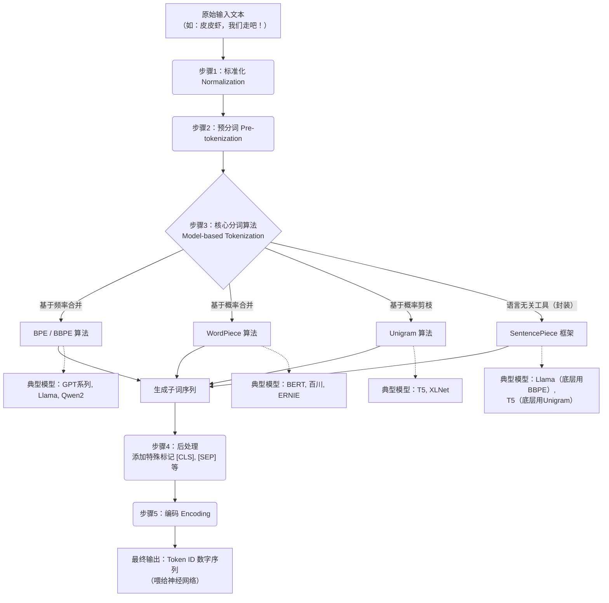

# 大模型Token与Tokenizer

> **摘要**：在大模型时代，Token比代码更“值钱”——它是算力的直接体现，也是计费的基本单位。本文系统梳理了Token的本质、中文拆分的实战误区、Tokenizer的标准工作流程、四大主流分词算法的原理与场景，并附带了完整的专有名词解释和参考文献，帮你一文读懂AI眼中的“语言积木”。

---

## 1. 引言：Token到底是什么？

如果你用过ChatGPT或任何大模型API，一定对“Token”这个词不陌生。但在不同领域，它的含义天差地别：

*   **AI大模型中**：它是**词元（Token）**，即文本处理的最小计量单位与计费单位。
*   **区块链中**：它是**代币/通证（Crypto Token）**，代表可交易的数字资产。
*   **计算机安全中**：它是**令牌（Security Token）**，用于身份验证。

本文聚焦于**大模型领域**的Token。在这个语境下，Token是模型理解和生成语言的“积木”。模型不能直接读懂汉字或英文单词，它只能处理数字。**Tokenizer（分词器）** 就是负责将人类语言拆解并编码为数字ID的“翻译官”。

---

## 2. 基础认知：Token的三大角色

在LLM生态中，Token扮演着三个关键角色：

1.  **语义单元**：它是模型处理文本的最小粒度，可以是一个完整的词，也可以是一个有意义的“子词”（Subword）。
2.  **计费货币**：所有主流大模型API（如OpenAI、Claude、智谱等）均按照输入（Prompt）和输出（Completion）的Token总量计费。
3.  **物理天花板**：每个模型都有**上下文窗口（Context Window）** 限制（如128k、200k），即单次能处理的最大Token数量，超出则无法响应。

---

## 3. 实战聚焦：中文Token到底怎么拆？

很多中文用户都有这个疑问：一个汉字算几个Token？成语呢？网上流传的“按偏旁部首拆分”说法准确吗？

### 3.1 反常识：绝对不拆“偏旁部首”

**结论前置**：Tokenizer **绝不**基于汉字字形（偏旁、部首）进行拆分。它依赖于**统计频率**和**语义完整性**，是纯粹的数学/概率过程。将“章”拆成“立+早”是输入法逻辑，而非AI分词逻辑。

### 3.2 中文计数估算规律（事实依据）

以下基于主流BBPE（字节级BPE）算法的通用表现：

| 文本类型        | 示例                 | 估算Token数              | 拆分逻辑                                        |
| :-------------- | :------------------- | :----------------------- | :---------------------------------------------- |
| **高频词组**    | “国王”、“我们”       | **1 ~ 2个**              | 常见词大概率被整体打包为1个Token。              |
| **成语/罕见词** | “墨守成规”           | **1 ~ 4个**              | 若在词表中则整体1个；否则拆分为单字（4个）。    |
| **热门短句**    | “皮皮虾，我们走吧！” | **约 5 ~ 9个**           | 例如：`[皮皮虾][,][我们][走吧][!]` 或拆得更细。 |
| **经验法则**    | 中文字符             | **1个汉字 ≈ 1~2个Token** | 英文单词平均占1.3个Token。                      |

---

## 4. Token全景流程图

> **说明**：下图使用Mermaid语法描述Token从输入到模型处理的完整生命周期，以及核心算法的分流逻辑。如果你在Markdown阅读器中无法渲染，请参考紧随其后的**文字版流程步骤**。

## 5. 核心机制：Tokenizer的五大标准工作流程

无论使用何种算法，Tokenizer将文本转化为模型输入（Token IDs）都要经历固定的流水线（与流程图一致）：

1. **标准化（Normalization）**：清洗数据（统一小写、去除多余空格、处理Unicode字符）。  
2. **预分词（Pre-tokenization）**：按空格和标点初步切分，设定“词”的上限。  
3. **模型分词（Model-based Tokenization，核心）**：使用算法将“词”切分为子词（Subword），解决未登录词（OOV）问题。  
4. **后处理（Post-processing）**：添加模型所需的特殊标记（如GPT的`<|endoftext|>`，BERT的`[CLS]`）。  
5. **编码（Encoding）**：将Token字符串映射为词表中对应的唯一数字ID。

---

## 6. 算法深水区：四大主流Tokenizer详解

这是决定模型“智商”底色的关键环节。理解它们的**拆分基准**，就能明白为什么不同模型的中文表现有差异。

### 6.1 BPE（字节对编码）
- **核心策略**：**自底向上合并（Bottom-up）**。  
- **拆分基准**：**共现频率（Frequency）**。统计语料中相邻字符对出现的频率，频率越高越优先合并成Token。  
- **特点**：简单高效，是GPT系列（GPT-2起使用**BBPE**字节级变种）、Llama系列、Qwen2的底层算法。  
- **BBPE进阶**：初始词表仅为256个字节，彻底解决了生僻字和Emoji的编码问题。

### 6.2 WordPiece
- **核心策略**：**自底向上合并（Bottom-up）**。  
- **拆分基准**：**概率似然度（Probability）**。不只看频率，而是选择合并后能使**整个语料概率提升最大**的字符对。分词时采用**贪心最长匹配（MaxMatch）**。  
- **特点**：统计上更优，是BERT、ALBERT及早期中文BERT变体（如`Chinese-BERT-wwm`）的主流选择。

### 6.3 Unigram（一元语言模型）
- **核心策略**：**自顶向下剪枝（Top-down）**。  
- **拆分基准**：**整体损失最小化（Loss）**。从一个包含所有可能子词的超大词表开始，迭代移除对整体概率损失影响最小的Token。  
- **特点**：分词时使用**维特比算法（Viterbi）** 找出概率最高的切分方式。常见于T5、XLNet等模型。

### 6.4 SentencePiece（工具框架）
- **核心策略**：**语言无关的直接处理**。  
- **特殊之处**：它不是算法，而是**工具库**。它**不依赖空格**进行预分词，直接将原始文本作为Unicode序列处理，对中日韩（CJK）语言极其友好。  
- **应用**：Llama系列底层通过它调用BBPE；T5通过它调用Unigram。

---

## 7. 模型生态圈：算法与代表模型映射表

| 算法/工具         | 核心特点               | 典型模型与应用场景                                    |
| :---------------- | :--------------------- | :---------------------------------------------------- |
| **BPE / BBPE**    | 追求效率与通用性       | **GPT全系列**、**Llama全系列**、Qwen2、RoBERTa、Gemma |
| **WordPiece**     | 深耕BERT生态与精细语义 | **BERT**、ALBERT、ERNIE（百度）、各种中文BERT变体     |
| **Unigram**       | 追求概率理论最优       | **T5系列**、XLNet、mBART                              |
| **SentencePiece** | 多语言与无空格语言救星 | 封装了上述算法，广泛用于多语言模型（如Llama底层使用） |

---

## 8. 附录：专有名词速查表（Glossary）

| 术语           | 英文                    | 通俗解释                                          |
| :------------- | :---------------------- | :------------------------------------------------ |
| **词元**       | Token                   | 模型处理的最小文本单元，也是计费单位。            |
| **分词器**     | Tokenizer               | 将文本转换成Token ID序列的工具。                  |
| **上下文窗口** | Context Window          | 模型单次能处理的最大Token数量上限。               |
| **词表**       | Vocabulary              | 所有Token及其对应数字ID的集合。                   |
| **未登录词**   | OOV (Out-of-Vocabulary) | 词表中不存在的词，子词分词主要为了解决它。        |
| **子词**       | Subword                 | 介于单词和字符之间的语义单元（如“ing”、“ed”）。   |
| **字节级BPE**  | BBPE                    | 以256个字节为初始词表的BPE变种，解决Unicode难题。 |
| **最大匹配**   | MaxMatch                | WordPiece使用的贪心分词策略，优先取最长匹配前缀。 |
| **维特比算法** | Viterbi                 | Unigram分词中用于寻找最优切分路径的动态规划算法。 |
| **特殊标记**   | Special Tokens          | 如`[CLS]`（分类）、`[SEP]`（分隔）、`<            | endoftext | >`（结束）。 |

---

## 9. 延伸阅读：核心参考文献

如需深入研究，推荐按以下顺序阅读原始文献：

1. **BPE引入NLP**：Sennrich, R., et al. (2016). *Neural Machine Translation of Rare Words with Subword Units*. ACL 2016.  
2. **SentencePiece**：Kudo, T., & Richardson, J. (2018). *SentencePiece: A simple and language independent subword tokenizer*. EMNLP 2018.  
3. **Unigram LM**：Kudo, T. (2018). *Subword Regularization: Improving Neural Network Translation Models*. ACL 2018.  
4. **Fast WordPiece**：Song, X., et al. (2021). *Fast WordPiece Tokenization*. EMNLP 2021.  
5. **开源工具**：Google SentencePiece (GitHub) 与 Hugging Face Tokenizers (GitHub)。

---

**结语**：大模型里的Token，是把文本按“统计频率”和“语义概率”切成小块（子词）的数字代号，而不是按“偏旁笔画”切出来的。掌握了Tokenizer的运作逻辑，你不仅能更精准地估算API成本，更能深刻理解不同模型（如GPT与BERT）在设计哲学上的底层差异。