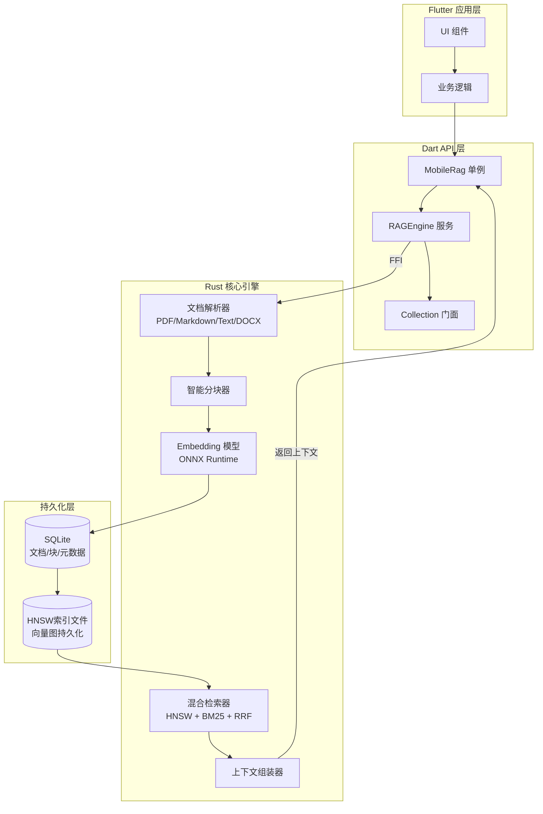
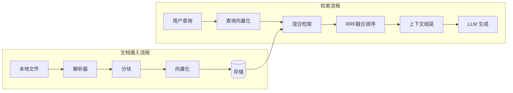
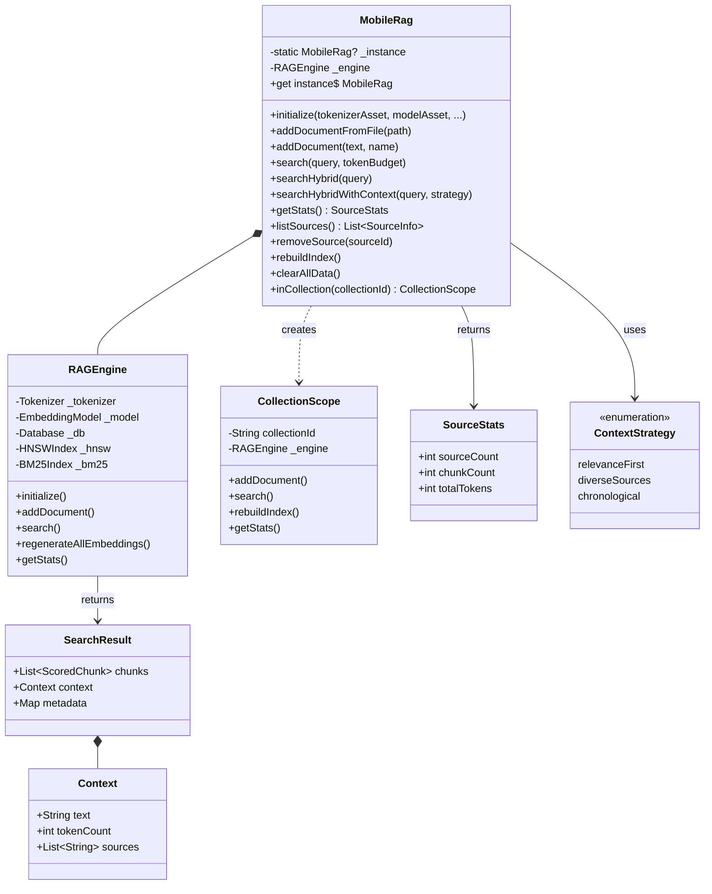
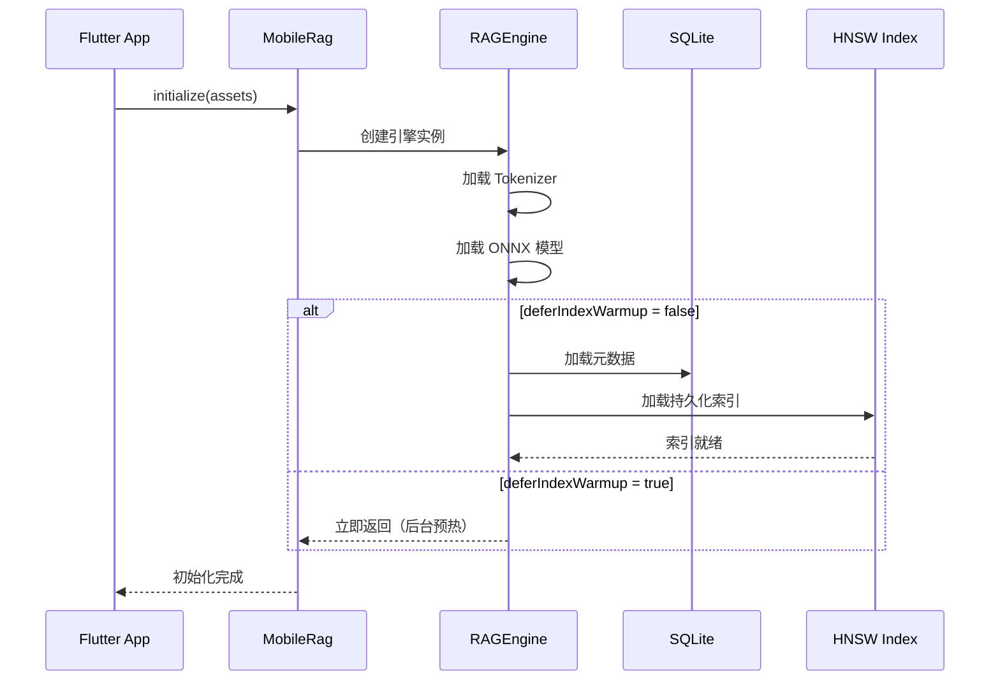
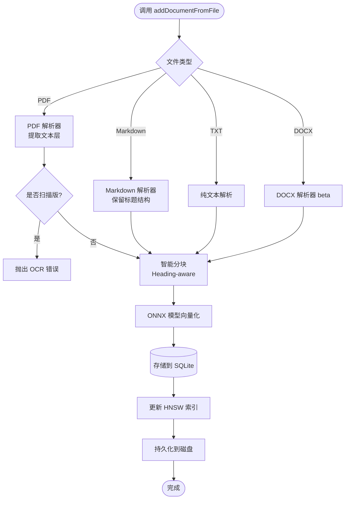
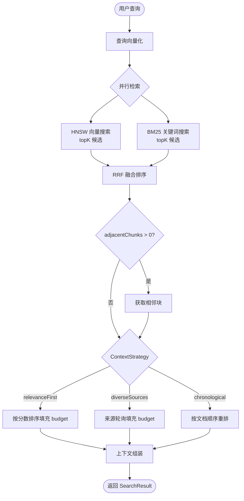

# Mobile RAG Engine 全面解析

## 一、简介

### 1.1 什么是 Mobile RAG Engine

Mobile RAG Engine 是一个**高性能、全离线运行的检索增强生成（Retrieval-Augmented Generation，RAG）引擎**，专为 Flutter 移动应用打造。它让开发者能够在 iOS、Android、macOS、Windows 和 Linux 上运行完全离线的语义搜索，无需任何服务器或 API 调用。

该引擎的核心能力包括：**本地文档解析、智能分块、设备端向量化（Embedding）、HNSW 向量索引 + BM25 关键词索引的混合检索，以及 LLM 就绪的上下文组装**。

### 1.2 核心定位

| 维度         | 说明                                                            |
| ------------ | --------------------------------------------------------------- |
| **技术栈**   | Flutter + Dart API 封装，核心引擎使用 **Rust** 编写             |
| **运行方式** | 100% 离线，数据从不离开用户设备                                 |
| **目标场景** | 私有笔记问答、PDF 文档对话、离线助手、企业级隐私应用            |
| **平台支持** | iOS 16.0+ / Android API 21+ / macOS 14.0+ / Windows 10+ / Linux |

### 1.3 与 Apple 生态的关系

在 WWDC 2025 上，Apple 正式推出了 **Foundation Models 框架**，为开发者提供了访问 Apple Intelligence 端侧大语言模型（30 亿参数、2-bit 量化）的 Swift API。虽然 Foundation Models 框架本身不包含内置的 Embedding 模型，但 Mobile RAG Engine 可以与之形成互补——前者提供**生成能力**，后者提供**检索层**。

Apple 官方文档明确指出，可以在设备端运行 RAG，但需要开发者自行实现向量存储和相似度搜索。这正是 Mobile RAG Engine 所解决的问题。

> **关键说明**：Mobile RAG Engine 是一个**第三方开源 Flutter 包**（作者：dev07060），并非 Apple 官方出品。但它与 Apple 的设备端 AI 战略高度契合，可以作为 Foundation Models 框架的检索层补充方案。


## 二、应用场景

### 2.1 典型使用场景

1. **私有笔记智能问答**：用户在笔记应用中搜索“我上周写的关于项目计划的内容”，引擎通过语义理解返回最相关的笔记片段。

2. **PDF 文档对话**：用户上传产品手册 PDF，通过 RAG 检索相关段落，配合 LLM 生成精确回答。

3. **离线企业知识库**：企业内部文档全部存储在设备本地，员工在无网络环境下也能检索公司政策、技术文档。

4. **隐私敏感型应用**：日记应用、健康记录、法律文档等场景，数据绝不能上传云端。

5. **多源信息汇总**：从多个文档中检索相关信息并汇总，例如“不同季度的销售报告分别说了什么？”。

### 2.2 不适合的场景

- **扫描版/图片型 PDF**：引擎会检测到并报错，需要额外集成 OCR 层。
- **超大表格/复杂排版 PDF**：仍在验证阶段，不建议作为核心功能依赖。
- **需要云端大模型能力的场景**：引擎只负责检索，LLM 生成需要另外集成。


## 三、架构设计与架构图

### 3.1 整体架构

Mobile RAG Engine 采用**分层架构**设计，从上到下依次为：

```
┌─────────────────────────────────────────────────────────────────┐
│                      Flutter 应用层                            │
│                   (Dart 业务代码)                              │
└─────────────────────────┬───────────────────────────────────────┘
                          │ Dart FFI
┌─────────────────────────▼───────────────────────────────────────┐
│                    Dart API 门面层                             │
│              (MobileRag 单例 + RAGEngine 服务)                 │
└─────────────────────────┬───────────────────────────────────────┘
                          │
┌─────────────────────────▼───────────────────────────────────────┐
│                      Rust 核心引擎                             │
│  ┌───────────┐ ┌───────────┐ ┌───────────┐ ┌───────────────┐ │
│  │ 文档解析器 │ │  分块器   │ │ Embedding │ │  检索器       │ │
│  │ PDF/MD/TXT │ │ 智能分块  │ │  ONNX模型 │ │ HNSW + BM25  │ │
│  └───────────┘ └───────────┘ └───────────┘ └───────────────┘ │
└─────────────────────────┬───────────────────────────────────────┘
                          │
┌─────────────────────────▼───────────────────────────────────────┐
│                      持久化层                                  │
│  ┌─────────────────┐  ┌────────────────────────────────────┐  │
│  │  SQLite 数据库   │  │  HNSW 索引文件 (.hnsw.data/graph) │  │
│  │ (文档/块/元数据) │  │  (向量索引持久化)                  │  │
│  └─────────────────┘  └────────────────────────────────────┘  │
└─────────────────────────────────────────────────────────────────┘
```

### 3.2 架构图（Mermaid）



### 3.3 数据流架构




## 四、实现原理

### 4.1 核心技术栈

| 组件               | 技术选型                                  | 说明                         |
| ------------------ | ----------------------------------------- | ---------------------------- |
| **跨平台框架**     | Flutter                                   | Dart 提供统一 API            |
| **核心引擎**       | Rust                                      | 高性能、内存安全、零拷贝传输 |
| **向量索引**       | HNSW (Hierarchical Navigable Small World) | 亚线性检索复杂度             |
| **关键词检索**     | BM25                                      | 经典词频-逆文档频率算法      |
| **融合排序**       | RRF (Reciprocal Rank Fusion)              | 向量 + 关键词结果融合        |
| **Embedding 模型** | ONNX Runtime                              | 支持 INT8 量化模型           |
| **持久化**         | SQLite                                    | 文档和块存储                 |

### 4.2 端到端 RAG 流水线

1. **文档摄入（Ingest）**：
   - 解析本地文件（PDF、Markdown、TXT、DOCX beta）
   - 智能分块（Heading-aware 分块，软字符目标 ~500 字符）
   - 通过 ONNX 模型生成向量 Embedding
   - 存储到 SQLite，同时构建 HNSW 索引

2. **检索（Retrieval）**：
   - 用户查询向量化
   - HNSW 向量相似度搜索 + BM25 关键词匹配
   - RRF 算法融合两种搜索结果

3. **上下文组装（Context Assembly）**：
   - 根据 Token Budget 精确截断
   - 支持多种策略：相关性优先、来源多样化、时间顺序
   - 返回 LLM 就绪的上下文字符串

### 4.3 性能优势

与纯 Dart 实现相比，Rust 核心带来的性能提升：

| 指标     | 纯 Dart       | Mobile RAG Engine (Rust)          |
| -------- | ------------- | --------------------------------- |
| 分词速度 | 慢            | HuggingFace tokenizers，10x+ 加速 |
| 向量检索 | O(n) 全量扫描 | HNSW 亚线性检索                   |
| 内存占用 | 高            | 零拷贝 Float32List 传输，内存优化 |

### 4.4 与 Apple Foundation Models 的关系

Apple 在 WWDC 2025 推出的 Foundation Models 框架提供了 3B 参数、2-bit 量化的设备端大语言模型。Apple 官方确认：

> “可以在设备端运行 RAG，但 Foundation Models 框架不包含内置的 Embedding 模型。你需要使用单独的数据库存储向量，并实现最近邻或余弦距离搜索。”

这意味着 Mobile RAG Engine 可以作为 Foundation Models 的**检索层补充**：
- Mobile RAG Engine 负责：文档解析、分块、向量化、向量存储与检索
- Foundation Models 负责：基于检索结果的文本生成


## 五、全景类图



### 核心类说明

| 类名                | 职责                           |
| ------------------- | ------------------------------ |
| **MobileRag**       | 单例门面，提供全局访问入口     |
| **RAGEngine**       | 核心引擎服务，组合所有底层组件 |
| **CollectionScope** | 集合作用域门面，支持多集合隔离 |
| **SearchResult**    | 检索结果封装，包含分块和上下文 |
| **Context**         | LLM 就绪的上下文字符串         |
| **ContextStrategy** | 上下文组装策略枚举             |


## 六、设计模式

### 6.1 单例模式（Singleton）

`MobileRag` 类采用单例模式，确保全局只有一个引擎实例：

```dart
// 全局单例访问
await MobileRag.initialize(...);
final result = await MobileRag.instance.search(query);
```

### 6.2 门面模式（Facade）

`MobileRag` 作为门面，隐藏了 `RAGEngine`、Tokenizer、Embedding Model、Database 等复杂子系统的细节，提供简洁的 API。

### 6.3 建造者模式（Builder）

初始化参数通过命名参数方式传递，支持灵活配置：

```dart
await MobileRag.initialize(
  tokenizerAsset: 'assets/tokenizer.json',
  modelAsset: 'assets/model.onnx',
  threadLevel: ThreadUseLevel.medium,
  deferIndexWarmup: true,
);
```

### 6.4 策略模式（Strategy）

`ContextStrategy` 枚举定义了不同的上下文组装策略：
- `relevanceFirst`：按相关性排序
- `diverseSources`：来源多样化
- `chronological`：按文档顺序

### 6.5 集合模式（Collection）

通过 `inCollection(id)` 方法创建集合作用域，实现多租户/多知识库隔离。


## 七、工作流程与工作流程图

### 7.1 初始化流程



### 7.2 文档摄入流程



### 7.3 检索流程




## 八、详细实现代码解释

### 8.1 添加依赖与模型下载

**pubspec.yaml**：
```yaml
dependencies:
  mobile_rag_engine: ^0.20.0
```

**下载模型文件**（默认 MiniLM-L6-v2，INT8 量化，~23MB）：
```bash
mkdir -p assets && cd assets
curl -L -o model.onnx \
  "https://huggingface.co/sentence-transformers/all-MiniLM-L6-v2/resolve/main/onnx/model_qint8_arm64.onnx"
curl -L -o tokenizer.json \
  "https://huggingface.co/sentence-transformers/all-MiniLM-L6-v2/resolve/main/tokenizer.json"
```

**注册 assets**：
```yaml
flutter:
  assets:
    - assets/model.onnx
    - assets/tokenizer.json
```

### 8.2 初始化引擎

```dart
import 'package:mobile_rag_engine/mobile_rag_engine.dart';

Future<void> initializeRAG() async {
  await MobileRag.initialize(
    tokenizerAsset: 'assets/tokenizer.json',
    modelAsset: 'assets/model.onnx',
    threadLevel: ThreadUseLevel.medium,  // 推荐大多数应用使用
    deferIndexWarmup: true,  // 快速 UI 渲染优先
    onProgress: (progress) {
      print('初始化进度: ${progress.percent}%');
    },
  );
}
```

### 8.3 添加文档

```dart
// 从文件添加
await MobileRag.instance.addDocumentFromFile(
  '/path/to/manual.pdf',
  name: 'manual.pdf',
);

// 从文本添加
await MobileRag.instance.addDocument(
  '这是文档的文本内容...',
  name: '我的笔记.txt',
);

// 添加到指定集合
await MobileRag.instance
    .inCollection('project_alpha')
    .addDocumentFromFile('/path/to/doc.pdf');
```

### 8.4 执行检索

```dart
// 基础检索（向量 + BM25 混合，自动组装上下文）
final result = await MobileRag.instance.searchHybridWithContext(
  '手册里关于安装步骤说了什么？',
  tokenBudget: 2000,  // LLM 上下文窗口预算
  strategy: ContextStrategy.relevanceFirst,  // 相关性优先
  topK: 10,  // 候选块数量
  adjacentChunks: 1,  // 获取前后各 1 个相邻块
);

// 获取 LLM 就绪的上下文
final contextForLlm = result.context.text;
print('上下文 Token 数: ${result.context.tokenCount}');
print('来源文档: ${result.context.sources}');

// 配合 LLM 生成回答
final prompt = '''
基于以下上下文回答问题：
---
${contextForLlm}
---
问题：手册里关于安装步骤说了什么？
''';
```

### 8.5 索引管理与维护

```dart
// 获取统计信息
final stats = await MobileRag.instance.getStats();
print('文档数: ${stats.sourceCount}');
print('块数: ${stats.chunkCount}');

// 列出所有文档
final sources = await MobileRag.instance.listSources();
for (final source in sources) {
  print('ID: ${source.id}, 名称: ${source.name}');
}

// 删除文档
await MobileRag.instance.removeSource(sourceId);

// 重建索引（删除大量数据后推荐）
await MobileRag.instance.rebuildIndex();

// 切换模型后重新生成 Embedding
await MobileRag.instance.engine.regenerateAllEmbeddings(
  onProgress: (done, total) {
    print('重新向量化: $done / $total');
  },
);

// 清空所有数据
await MobileRag.instance.clearAllData();
```


## 九、关键数据参数汇总表格

### 9.1 初始化参数

| 参数                         | 默认值         | 说明                                                |
| ---------------------------- | -------------- | --------------------------------------------------- |
| `tokenizerAsset`             | **必填**       | tokenizer.json 在 assets 中的路径                   |
| `modelAsset`                 | **必填**       | ONNX 模型在 assets 中的路径                         |
| `databaseName`               | `'rag.sqlite'` | SQLite 数据库文件名                                 |
| `maxChunkChars`              | `500`          | 每块软字符目标（<100 自动归一化为 100）             |
| `overlapChars`               | `30`           | 块间重叠字符数（<0 自动归一化为 0）                 |
| `threadLevel`                | `null`         | CPU 使用级别：low(~20%) / medium(~40%) / high(~80%) |
| `embeddingIntraOpNumThreads` | `null`         | 精确线程数（与 threadLevel 二选一）                 |
| `deferIndexWarmup`           | `false`        | true 时初始化立即返回，后台预热索引                 |
| `onProgress`                 | `null`         | 初始化进度回调                                      |

### 9.2 检索参数

| 参数             | 默认值           | 说明                                   |
| ---------------- | ---------------- | -------------------------------------- |
| `topK`           | `10`             | 初始检索的候选块数量                   |
| `tokenBudget`    | `2000`           | 最终上下文字符串的最大 Token 数        |
| `adjacentChunks` | `0`              | 每个匹配块前后额外获取的块数           |
| `vectorWeight`   | `0.2`            | 向量搜索权重（与 bm25Weight 之和为 1） |
| `bm25Weight`     | `0.8`            | BM25 关键词搜索权重                    |
| `strategy`       | `relevanceFirst` | 上下文组装策略                         |

### 9.3 性能基准数据

| 指标                    | 数值    | 说明                                 |
| ----------------------- | ------- | ------------------------------------ |
| `source_recall@10`      | `1.000` | 80 个来源混合测试，Top-10 来源召回率 |
| `passage_recall@10`     | `0.925` | 80 查询段落测试，Top-10 段落召回率   |
| `answerable_context@10` | `0.938` | Top-10 可回答上下文比例              |

### 9.4 模型对比

| 模型         | 维度 | 大小   | 适用场景             |
| ------------ | ---- | ------ | -------------------- |
| MiniLM-L6-v2 | 384  | ~23MB  | 英文应用（默认推荐） |
| BGE-m3       | 1024 | ~542MB | 多语言/韩语/CJK 应用 |


## 十、常见问题与解决方案

### Q1: 支持中文/韩语吗？
**A**: 支持！切换到 BGE-m3 模型即可，支持 100+ 语言：
```bash
curl -L -o model.onnx \
  "https://huggingface.co/Teradata/bge-m3/resolve/main/onnx/model_int8.onnx"
curl -L -o tokenizer.json \
  "https://huggingface.co/BAAI/bge-m3/resolve/main/tokenizer.json"
```

### Q2: BGE-m3 太大（542MB），怎么办？
**A**: 三种方案：
1. 使用 MiniLM（~23MB，仅英文）
2. 首次启动时动态下载
3. 接受大小（iOS 允许 4GB，Android Play 允许 150MB AAB）

### Q3: 能在 iOS 模拟器上测试吗？
**A**: 可以，但速度比真机慢 3-5 倍。性能测试务必在物理设备上运行。

### Q4: 切换模型后怎么办？
**A**: 必须重新 Embedding 所有文档。不同模型向量维度不同（BGE-m3:1024，MiniLM:384），会报维度不匹配错误。使用 `regenerateAllEmbeddings()` 重新生成。

### Q5: 扫描版/图片型 PDF 怎么办？
**A**: 引擎会检测并抛出 OCR 错误。需要额外集成 OCR 层（如 Apple 的 Vision 框架或第三方 OCR 服务）。

### Q6: App 崩溃后索引会损坏吗？
**A**: 不会。引擎使用 `.dirty` 标记文件实现崩溃恢复。下次启动时自动检测并从 SQLite 重建索引。


## 十一、最佳实践

### 11.1 模型选择策略

| 场景           | 推荐模型     | 理由                   |
| -------------- | ------------ | ---------------------- |
| 英文通用问答   | MiniLM-L6-v2 | 轻量（23MB），速度快   |
| 多语言/非英文  | BGE-m3       | 100+ 语言支持          |
| 快速原型验证   | MiniLM-L6-v2 | 下载快，迭代方便       |
| 生产环境高精度 | BGE-m3       | 更高维度，更好语义理解 |

### 11.2 性能优化建议

1. **线程控制**：大多数应用使用 `ThreadUseLevel.medium`。低端设备用 `low`，高端设备用 `high`。

2. **延迟索引预热**：设置 `deferIndexWarmup: true` 可加快首屏渲染，但首次搜索会稍慢。

3. **合理设置 tokenBudget**：根据 LLM 上下文窗口设定。例如 4K 上下文模型建议使用 ~3000。

4. **定期重建索引**：删除大量数据（>50%）后调用 `rebuildIndex()` 回收内存。

### 11.3 与 Apple Foundation Models 集成

```swift
// Swift 侧（使用 Foundation Models 框架）
import FoundationModels

let session = try await LanguageModelSession()
let ragContext = // 从 Mobile RAG Engine 获取的上下文字符串

let prompt = """
基于以下信息回答问题：
\(ragContext)
问题：...
"""

let response = try await session.generate(prompt: prompt)
```

### 11.4 生产部署注意事项

- **模型文件大小**：MiniLM ~23MB 适合直接打包；BGE-m3 ~542MB 建议首次启动下载
- **索引持久化**：引擎自动保存 HNSW 索引到磁盘，确保快速启动
- **错误处理**：PDF 解析可能失败，做好降级方案


## 十二、相关依赖

### 12.1 核心依赖

| 依赖            | 用途               |
| --------------- | ------------------ |
| **onnxruntime** | ONNX 模型推理引擎  |
| **SQLite**      | 文档和块持久化存储 |
| **HNSW**        | 向量索引算法实现   |

### 12.2 相关开源项目

| 项目                                                                                  | 说明                                  |
| ------------------------------------------------------------------------------------- | ------------------------------------- |
| [foundation-models-retrieval](https://github.com/Dean151/foundation-models-retrieval) | Apple Foundation Models 的 RAG 工具包 |
| [VecturaKit](https://github.com/rryam/VecturaKit)                                     | Swift 向量数据库，支持 MLX            |
| [mlx-rag](https://github.com/raghavdixit99/gte_mlx_rag)                               | MLX 框架的 RAG 示例                   |
| [agentkitten](https://github.com/fbeeper/agentkitten)                                 | Apple 平台 AI Agent Swift 包          |


## 十三、本地部署

### 13.1 环境要求

| 平台    | 最低版本              |
| ------- | --------------------- |
| iOS     | 16.0+                 |
| Android | API 21+ (Android 5.0) |
| macOS   | 14.0+                 |
| Windows | 10+                   |
| Linux   | 最新 LTS              |
| Flutter | 3.9+                  |

### 13.2 部署步骤

**Step 1: 添加依赖**
```yaml
dependencies:
  mobile_rag_engine: ^0.20.0
```

**Step 2: 下载模型**（见第八章）

**Step 3: 初始化引擎**（见第八章）

**Step 4: 构建应用**
```bash
flutter build ios   # iOS
flutter build apk   # Android
flutter build macos # macOS
```

**Step 5: 预编译二进制**
包已包含所有平台的预编译二进制文件，无需安装 Rust 或 Android NDK。


## 十四、参考文档

### 14.1 官方文档

- [Mobile RAG Engine GitHub](https://github.com/dev07060/mobile_rag_engine)
- [Flutter Local RAG Engine Guide](https://github.com/dev07060/mobile_rag_engine/blob/main/docs/local-rag-engine.md)
- [Quick Start Guide](https://github.com/dev07060/mobile_rag_engine/blob/main/docs/guides/quick_start.md)
- [FAQ](https://github.com/dev07060/mobile_rag_engine/blob/main/docs/guides/faq.md)
- [Search Strategies](https://github.com/dev07060/mobile_rag_engine/blob/main/docs/features/search_strategies.md)
- [Index Management](https://github.com/dev07060/mobile_rag_engine/blob/main/docs/features/index_management.md)

### 14.2 Apple 官方文档

- [Foundation Models Framework - Apple Developer](https://developer.apple.com/documentation/foundationmodels)
- [Meet the Foundation Models framework - WWDC25](https://developer.apple.com/videos/play/wwdc2025/101)
- [Deep dive into the Foundation Models framework - WWDC25](https://developer.apple.com/videos/play/wwdc2025/102)
- [Can I give additional context to Foundation Models?](https://developer.apple.com/forums/thread/773527)
- [TN3193: Managing the on-device foundation model's context window](https://developer.apple.com/documentation/technotes/tn3193)

### 14.3 开源项目

- [dev07060/mobile_rag_engine](https://github.com/dev07060/mobile_rag_engine)
- [Dean151/foundation-models-retrieval](https://github.com/Dean151/foundation-models-retrieval)
- [rryam/VecturaKit](https://github.com/rryam/VecturaKit)
- [raghavdixit99/gte_mlx_rag](https://github.com/raghavdixit99/gte_mlx_rag)
- [fbeeper/agentkitten](https://github.com/fbeeper/agentkitten)


## 十五、总结

Mobile RAG Engine 是一个**生产就绪的、完全离线的 Flutter RAG 解决方案**，其核心亮点包括：

1. **高性能**：Rust 核心 + HNSW 索引，实现亚线性检索
2. **零依赖编译**：预编译二进制，无需 Rust 环境
3. **隐私优先**：100% 离线，数据永不离开设备
4. **灵活扩展**：支持自定义 ONNX 模型、多集合隔离、多种检索策略
5. **Apple 生态友好**：可作为 Foundation Models 框架的检索层补充

在 Apple 大力推动设备端 AI（WWDC 2025 的 Foundation Models 框架、WWDC 2026 的 Core Spotlight RAG 集成）的背景下，Mobile RAG Engine 为 Flutter 开发者提供了一个**低成本、高可靠性**的本地 RAG 方案，是构建隐私敏感型 AI 应用的有力工具。