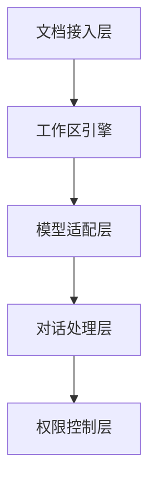
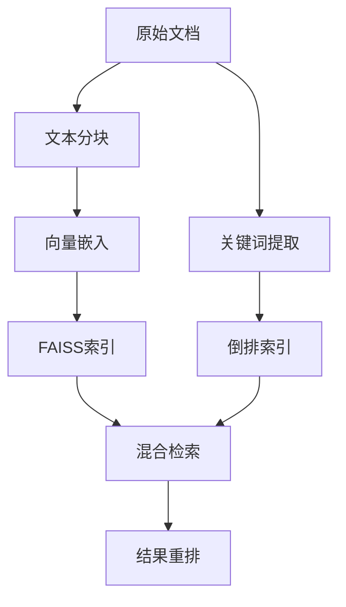

# AnythingLLM

## 一、概述与核心定位

AnythingLLM 是由 Mintplex Labs 开发的一款**全栈式、零代码**的AI应用平台，旨在让用户无需复杂的基础设施配置，即可构建集 RAG（检索增强生成）、AI Agent 和私有知识库于一体的智能系统。

该项目的核心价值体现在三个层面：

| 核心能力         | 解决的问题                                                    |
| :--------------- | :------------------------------------------------------------ |
| **模型无关性**   | 支持20+种开源与云端模型的统一接入，实现"一次开发，多模型适配" |
| **数据主权保障** | 通过本地化部署和RAG技术，确保敏感数据不出域                   |
| **自动化工作流** | 提供可视化技能编排引擎，支持复杂任务的链式调用                |

典型应用场景包括金融合规文档分析、医疗病历摘要生成、科研文献智能检索等对数据隐私敏感的领域。

---

## 二、技术架构设计

### 2.1 整体架构分层

AnythingLLM 采用**分层模块化架构**，主要包括以下核心层次：



**各层职责**：

- **文档接入层**：支持 PDF、DOCX、Markdown 等多种格式解析，通过OCR处理扫描件，统一转换为结构化数据。
- **工作区引擎**：实现文档的容器化管理，每个工作区包含独立的文档索引和向量嵌入库。
- **模型适配层**：提供标准化API接口，封装不同LLM的调用差异，支持模型热切换和负载均衡。
- **对话处理层**：实现上下文检索、答案生成和结果优化全流程。
- **权限控制层**：集成RBAC权限模型，支持工作区级、文档级、字段级三级权限控制。

### 2.2 模型适配器接口

框架通过统一的**模型适配器接口**实现多模型接入：

```python
class ModelAdapter:
    def __init__(self, model_type: str, endpoint: str):
        self.model_type = model_type  # 支持 local/remote 类型
        self.endpoint = endpoint      # 本地路径或API端点

    def generate(self, prompt: str, params: dict) -> str:
        """标准化生成接口"""
        # 具体适配逻辑隐藏在实现中
        pass
```

这种设计使开发者可以基于统一接口快速切换不同模型供应商，支持从7B到175B参数规模的多种架构。

### 2.3 隐私增强型检索引擎

AnythingLLM 的 RAG 检索引擎采用**双阶段混合检索架构**：



**技术指标**：
- **向量嵌入模型**：默认使用 `sentence-transformers/all-MiniLM-L6-v2`
- **检索响应时间**：10万文档规模下 < 500ms
- **召回率**：保持92%以上

### 2.4 工作区隔离机制

工作区（Workspace）是 AnythingLLM 的核心隔离单元，每个工作区拥有：
- **独立索引**：专属的倒排索引和向量数据库
- **上下文隔离**：通过工作区ID作为过滤条件，确保检索结果来源可控
- **资源配额**：支持独立的计算资源配置

```python
# 示例：工作区隔离的查询实现
def query_workspace(workspace_id, query_text):
    # 添加工作区过滤条件
    filtered_query = f"{query_text} workspace:{workspace_id}"
    results = vector_db.similarity_search(filtered_query)
    return results
```

---

## 三、核心功能详解

### 3.1 三种对话模式

AnythingLLM 提供三种对话模式，可根据场景灵活切换：

| 模式                  | 工作原理                              | 适用场景                         |
| :-------------------- | :------------------------------------ | :------------------------------- |
| **Agent模式（推荐）** | 自动调用可用的技能、工具和MCP完成任务 | 需要工具调用和多步推理的复杂任务 |
| **Chat模式**          | 结合文档和AI通用知识回答              | 头脑风暴、开放式探索             |
| **Query模式**         | 仅使用已上传文档的信息回答            | 需要精确、基于文档的答案         |

> Agent模式在 v1.11.1 以上版本默认启用，并支持**原生工具调用**——只要提供商支持，无需 `@agent` 指令即可自动使用工具。

### 3.2 文档处理：RAG vs 附件

AnythingLLM 提供两种文档使用方式：

**1. RAG（检索增强生成）**
- 文档被分块并向量化存入向量数据库
- 仅检索语义相关的少量片段送入LLM
- 节省token、速度快，适合大规模文档库

**2. 附件（Attached Documents）**
- 完整文本直接插入对话上下文
- LLM可访问完整内容，回答更精准
- 适合文档较小、需要全文理解的情况

> 当附件内容超过模型上下文窗口时，AnythingLLM 会询问用户是否将文档转为 RAG 嵌入。

### 3.3 Agent Flow（智能体流程）

**Agent Flow** 是 AnythingLLM v1.8.0 引入的**无代码**智能体技能构建方式。

| 构建方式                 | 目标用户         | 特点                            |
| :----------------------- | :--------------- | :------------------------------ |
| **Agent Flow（无代码）** | 所有用户         | 可视化拖拽构建，内置30+原子操作 |
| **Agent Skill（代码）**  | 开发者和高级用户 | 通过代码实现自定义技能          |

Agent Flow 支持 LLM 将多个流程**链式调用**以完成复杂任务，内置原子操作包括：
- 文本处理类：翻译、纠错、情感分析
- 数据分析类：表格解析、图表生成
- 系统操作类：API调用、数据库查询、文件操作

### 3.4 Agent 长期记忆机制

Agent 具备**长期记忆能力**，通过 `agent_memory.txt` 标签在向量数据库中存储信息：

- **存储方式**：通过"RAG & 长期记忆"技能，将信息直接写入工作区的向量数据库
- **触发条件**：用户明确要求"记住这个"或"保存到记忆"时触发
- **注意事项**：较弱的模型可能会自主决定存储信息，当前版本尚无独立的记忆审计UI

### 3.5 RAG 调优参数

AnythingLLM 提供精细的 RAG 调优选项：

| 参数                              | 说明                        | 建议                                      |
| :-------------------------------- | :-------------------------- | :---------------------------------------- |
| **Search Preference**             | 是否启用重排序（Reranking） | 追求精度可开启，但会增加100-500ms响应时间 |
| **Max Context Snippets**          | 送入LLM的相关片段数量       | 大部分模型建议4-6个                       |
| **Document Similarity Threshold** | 相似度过滤阈值              | 默认20%，如出现幻觉可设为"无限制"         |

---

## 四、部署与开发实践

### 4.1 本地化部署

**推荐硬件配置**：

| 配置等级 | GPU                           | 内存     |
| :------- | :---------------------------- | :------- |
| 基础版   | NVIDIA RTX 3060+              | 16GB RAM |
| 专业版   | 专业计算卡（支持Tensor Core） | 32GB RAM |

**Docker 部署命令**：
```bash
docker run -d \
  --gpus all \
  -p 7860:7860 \
  -v /path/to/data:/data \
  anythingllm:latest
```

### 4.2 开发扩展

**添加新模型**：
1. 实现 `ModelAdapter` 接口
2. 配置模型参数（温度、top_p等）
3. 注册到模型管理器

**自定义 Skill 示例**：
```python
from anyllm.skills import BaseSkill

class PDFParserSkill(BaseSkill):
    def execute(self, file_path):
        import fitz
        doc = fitz.open(file_path)
        text = "\n".join([page.get_text() for page in doc])
        return {"extracted_text": text}
```

### 4.3 性能优化策略

- **模型量化**：支持 INT8/FP16，在保持95%精度下提升2倍推理速度
- **缓存机制**：高频查询结果建立多级缓存（内存+磁盘）
- **异步处理**：长任务拆解为子任务并行执行
- **动态批处理**：根据GPU显存自动调整批次大小

---

## 五、近期重要更新（v1.8.2 - v1.12.0）

| 版本    | 核心功能                                                                                                                      | 来源 |
| :------ | :---------------------------------------------------------------------------------------------------------------------------- | :--- |
| v1.12.0 | 原生工具调用自动模式、智能工具选择（节省80% token）、文件系统Agent、文档生成Agent（支持PPT/PDF/Excel/Docx）、Telegram Bot支持 |      |
| v1.8.2  | PGVector支持、聊天窗口热切换模型、Agent Flow社区市场导入、MCP子技能细粒度管理                                                 |      |

---

## 六、总结

AnythingLLM 通过**统一模型适配层**、**工作区隔离机制**和**可视化 Agent Flow**，将 RAG、AI Agent 和私有知识库整合为一个零门槛、可扩展的企业级AI应用平台。其设计理念强调：

- **隐私优先**：所有数据处理可在本地完成
- **模型无关**：一套接口适配主流LLM
- **无代码体验**：通过Agent Flow让非技术人员也能构建AI工作流

随着多模态支持、边缘计算优化等方向的推进，AnythingLLM 在企业知识管理领域的应用价值将持续提升。