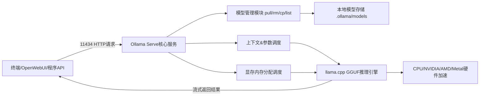
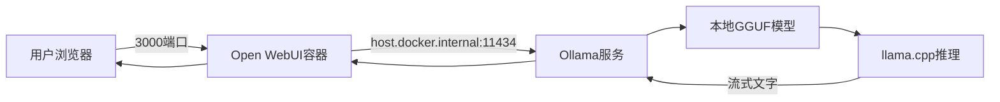

# Ollama 整体架构图 + 完整工作流程图
## 一、Ollama 整体分层架构图
```
┌─────────────────────────────────────────────────────────────┐
│                     客户端接入层                              │
│  Open WebUI(3000)  |  Python/JS程序  | curl API | 终端ollama命令 │
└───────────────────────┬─────────────────────────────────────┘
                        │ HTTP REST API :11434
                        ▼
┌─────────────────────────────────────────────────────────────┐
│                  Ollama 核心服务层（ollama serve）            │
│  ┌─────────────┐  ┌────────────┐  ┌─────────────────────┐   │
│  │API路由模块  │  │模型管理器  │  │GPU/内存调度引擎     │   │
│  │接收请求、   │  │pull/rm/cp  │  │自动分配显存/内存     │   │
│  │分发对话任务 │  │本地模型库  │  │GGUF量化推理调度     │   │
│  └─────────────┘  └────────────┘  └─────────────────────┘   │
│  ┌─────────────┐  ┌────────────┐  ┌─────────────────────┐   │
│  │Modelfile解析│  │对话上下文  │  │模型导出导入模块     │   │
│  │自定义模型构建│  │会话缓存    │  │export/import离线包  │   │
│  └─────────────┘  └────────────┘  └─────────────────────┘   │
└───────────────────────┬─────────────────────────────────────┘
                        │
                        ▼
┌─────────────────────────────────────────────────────────────┐
│                   底层推理引擎层                              │
│               llama.cpp（GGUF标准推理内核）                   │
│    支持 NVIDIA CUDA / AMD ROCm / Apple Metal / CPU 纯内存推理 │
└───────────────────────┬─────────────────────────────────────┘
                        │
                        ▼
┌─────────────────────────────────────────────────────────────┐
│                     本地模型存储层                            │
│ Windows: C:\Users\xxx\.ollama\models                         │
│ Linux/Mac: ~/.ollama/models                                  │
│  ├─ blobs 模型二进制分片文件（GGUF本体）                      │
│  └─ manifests 模型元数据、版本、量化信息、对话模板           │
└─────────────────────────────────────────────────────────────┘
```

### 架构层级说明
1. **接入层**
   所有交互入口：命令行、Open WebUI可视化面板、第三方代码API，统一通过 `11434` 端口HTTP协议和Ollama通信。
2. **Ollama核心服务**
   主控中枢，负责模型下载、本地管理、资源调度、请求转发、会话上下文管理；
3. **推理内核 llama.cpp**
   实际大模型计算核心，兼容GGUF量化模型，自动适配各类显卡加速；
4. **存储层**
   所有下载模型持久化本地，无联网也可离线推理。

---

# 二、Ollama + Open WebUI 完整工作数据流图
## 场景1：下载模型流程（WebUI图形化pull）
```
用户浏览器打开Open WebUI(3000)
        ↓
WebUI发送POST API /api/pull 到 localhost:11434
        ↓
Ollama服务接收拉取请求
        ↓
1. 校验本地是否存在该模型$$
   ├─已存在：直接返回模型信息
   └─不存在：向ollama.com模型仓库分片下载GGUF文件
        ↓
下载分片存入 .ollama/models/blobs
        ↓
写入manifests元数据，注册本地模型
        ↓
Ollama返回下载进度流给WebUI
        ↓
WebUI页面展示下载进度条，完成后模型出现在模型列表
```

## 场景2：对话推理完整流程（最常用）
```
用户在Open WebUI输入提问，选择模型qwen2.5:7b
        ↓
WebUI封装请求（prompt、temperature、上下文、窗口长度）
POST /api/chat -> 127.0.0.1:11434
        ↓
Ollama核心服务
  1. 查询模型管理器：检查模型是否已加载到显存
  2. 未加载：调用llama.cpp加载GGUF模型至GPU显存
  3. 已加载：复用现有显存模型，节省加载时间
        ↓
组装系统提示词 + 历史对话上下文 + 用户当前提问
        ↓
llama.cpp 流式逐token推理生成文字
        ↓
Ollama以SSE流式接口实时返回片段
        ↓
Open WebUI逐字实时渲染输出，保存对话记录到本地容器数据卷
        ↓
推理结束，会话缓存保留上下文，支持多轮连续对话
```

## 场景3：命令行 ollama run 终端对话流程
```
终端执行 ollama run qwen2.5:7b
        ↓
客户端程序连接本地ollama serve 11434端口
        ↓
无本地模型 → 自动执行ollama pull下载
        ↓
加载模型进推理引擎
        ↓
终端接收用户输入prompt
        ↓
流式返回推理文字至控制台
        ↓
输入 /bye 断开连接，模型保留显存缓存（ollama ps可查看）
```

## 场景4：模型删除流程
```
WebUI点击Delete / 执行 ollama rm qwen2.5:7b
        ↓
Ollama模型管理器
  1. 移除manifests内模型注册信息
  2. 判断blob分片是否被其他模型共用
     ├─共享文件：不删除
     └─仅当前模型使用：删除对应GGUF二进制文件释放磁盘
        ↓
本地模型列表不再展示该模型
```

---

# 三、Docker Open WebUI 容器网络互通架
```
┌───────────── 宿主机（本机）─────────────┐
│  Ollama 服务 127.0.0.1:11434           │
│  模型存放目录：~/.ollama/models         │
└───────────────────┬───────────────────┘
                    │ host.docker.internal
                    ▼
┌──────────── Docker容器 Open WebUI ───────────┐
│ 端口映射：3000(宿主机) ↔ 8080(容器内)        │
│ 数据持久卷 open-webui：聊天记录、用户配置     │
│ 内置网络配置 --add-host=host.docker.internal │
└─────────────────────────────────────────────┘
```
关键说明：
`--add-host=host.docker.internal:host-gateway` 让容器内WebUI能访问宿主机11434端口的Ollama，不加该参数会出现**无法读取本地模型、对话报错**。

---

# 四、极简流程图
## 1. 总流程Mermaid代码（直接粘贴支持Mermaid的文档/笔记渲染）


## 2. WebUI对话流程Mermaid
