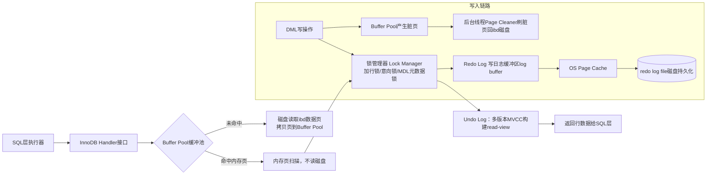
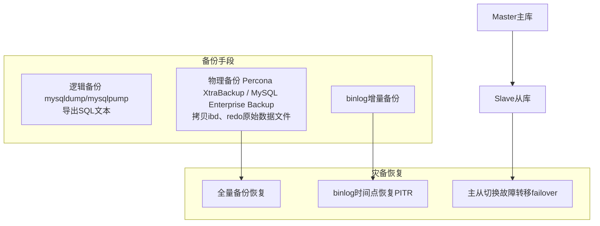
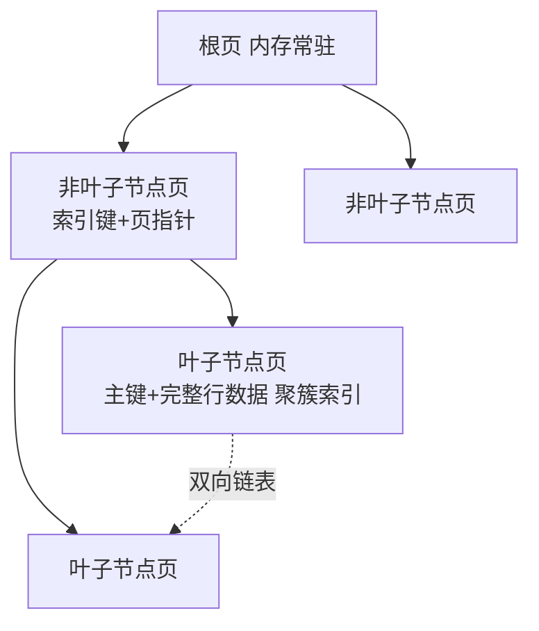

# MySQL简介

## 图1：MySQL完整SQL查询执行链路（Mermaid流程图）


> 参考 MySQL8.0 Official Reference Manual Chapter 8 Query Optimization
1. **连接器**：管理TCP连接，校验账号密码权限，8.0使用线程池应对高并发；查询缓存在8.0彻底删除，因为高并发下失效开销大于收益。
2. **解析器**：生成抽象语法树AST，语法错误在此抛出。
3. **预处理器**：检查表/列是否存在，处理别名、视图。
4. **优化器**：基于统计信息，生成最优执行计划，决定走哪个索引、join顺序。**不访问真实数据，只生成计划**。
5. **执行器**：调用存储引擎统一handler接口，SQL层和InnoDB引擎解耦。
6. InnoDB负责真实读取页、内存缓冲、锁、事务。

> 关键点：**SQL层不操作磁盘数据，全部委托存储引擎**。

---

## 图2：InnoDB引擎内部工作链路（重点：Buffer Pool内存扫描、页拷贝、锁）


1. **Buffer Pool缓冲池**：InnoDB核心内存，存放数据页、索引页。
    - 查询优先扫描内存；页不在内存，触发IO，把磁盘页**拷贝复制到Buffer Pool内存**。
    - 内存扫描：直接操作内存页结构，不需要磁盘IO。
2. **锁管理器 Lock Manager**
    - MDL元数据锁：DDL/DML都会获取，防止表结构变更和查询并发冲突。
    - 行锁：基于索引记录锁、gap锁、next‑key锁；**InnoDB行锁只锁索引记录，无索引退化为表锁**。
3. MVCC：依靠Undo log回滚段构建历史版本，read‑view实现快照读，不加行锁。
4. Redo Log：崩溃恢复核心；写操作先写redo log（WAL预写日志），再异步刷脏页到ibd磁盘，保障崩溃不丢数据。
> WAL原则：修改内存，日志先行落盘，脏页延迟刷盘。

---

## 图3：InnoDB主从数据同步复制链路

### 官方解说
> MySQL8.0复制文档：支持异步复制、半同步复制、组复制MGR
1. binlog：主库SQL层生成，记录数据变更逻辑事件；格式：STATEMENT/ROW/MIXED，生产强烈推荐ROW行格式。
2. IO线程：拉取主库binlog，写入本地relay‑log中继日志。
3. SQL线程：回放中继日志，重放变更。
4. 同步模式取舍：
    - 异步：性能最高，主宕机有数据丢失风险。
    - 半同步：至少一个从收到日志返回确认，降低丢失概率，有性能损耗。
    - MGR组复制：paxos协议，强一致性，性能开销最大。

---

## 图4：备份与灾备架构

### 官方说明
1. **逻辑备份mysqldump**：导出SQL，跨版本兼容；大数据量慢，不适合TB级。
2. **物理热备份 XtraBackup**：直接拷贝InnoDB磁盘文件，热备份不锁库；适合大生产库。
3. PITR时间点恢复：全量备份 + binlog增量回放，可以恢复到任意时间点。
4. 灾备：主从架构是基础，备份+binlog是最后兜底。

---

## 图5：InnoDB索引原理 B+Tree

### 权威解说
> InnoDB聚簇索引：
1. **聚簇主键索引**：叶子节点存放完整行数据；二级索引叶子存放主键值，回表查询获取完整行。
2. B+树非叶子只存索引key和页指针；叶子双向链表，范围查询高效。
3. 二级索引查询：先查二级索引拿到主键，再回表查询聚簇索引，产生额外IO。

---

## 约束、触发器、级联外键原理
1. **约束（主键、唯一、非空、check、外键）**
    - check约束8.0正式生效；约束校验在InnoDB存储引擎层执行，不是SQL解析层。
    - 外键级联 `ON DELETE CASCADE`：引擎层检测父记录删除，自动删除子表关联记录；**生产高并发不推荐外键**：约束校验会持有锁，容易死锁、性能下降。
2. **触发器 trigger**：SQL层执行，DML触发执行自定义SQL；触发器对应用层透明，故障排查困难，高并发场景尽量规避。

## 数据精度、存储上限（MySQL官方参数）
1. 数值精度：
    - `DECIMAL(M,D)`定点精确存储；float/double浮点数二进制存储，存在精度丢失，财务禁止使用float。
2. InnoDB单表上限：
    - 单表最大64TB（ibd文件）；单页16KB；行最大约65535字节；大文本BLOB溢出存储到溢出页。
3. 索引单键最大长度：767字节（老版本），8.0开启innodb_large_prefix最大3072字节。

## 表结构设计原则（官方最佳实践）
1. InnoDB必须主键，推荐自增整数主键（B+树页分裂最小）；禁止业务主键。
2. 字段尽量NOT NULL，NULL会占用额外存储，影响索引。
3. 财务使用DECIMAL，禁止double/float。
4. 大文本拆分，避免单行长过大。
5. 少用外键、触发器，业务代码实现约束逻辑。
6. 避免大索引，联合索引遵循最左前缀。

## 性能优化指南（官方8.0优化手册）
1. 内存：`innodb_buffer_pool_size` 物理内存50‑70%，最重要参数。
2. redo log：调整`innodb_log_file_size`，减少checkpoint刷盘抖动。
3. 锁：避免大事务；大事务持有锁时间长，产生锁等待、死锁。
4. SQL：explain分析执行计划，避免回表、全表扫描；尽量覆盖索引。
5. 连接：线程池、慢查询日志slow_query_log抓慢SQL。

## 生产故障排查
1. 慢查询日志、performance_schema：定位慢SQL。
2. `show engine innodb status`：看锁等待、死锁日志、事务状态。
3. show processlist：会话、长事务。
4. performance_schema监控IO、锁、内存。

## 高并发场景架构取舍（权衡性能 vs 一致性）
1. **一致性高，性能下降**：强半同步复制、大事务、外键约束、高隔离级别RR；适合金融。
2. **追求高并发性能**：异步复制、业务层实现约束、拆分大事务、降低锁持有时间；接受复制延迟风险。
3. 取舍点：
    - 不要用数据库做分布式锁，高并发锁竞争会直接打垮MySQL。
    - 热点行更新，拆分行、队列削峰，避免行锁冲突。
    - 读压力大：主写，从库读分离；写压力大：分库分表。
    - 事务隔离级别：默认RR；读多场景可考虑RC，减少gap锁，降低锁冲突，牺牲部分幻读防护。

## 特殊案例
1. 热点更新：同一行高频update，会大量行锁等待；解决方案：队列缓冲、业务拆分。
2. 大事务：千万行DML，持有锁很久，binlog巨大，主从延迟爆炸；拆成分批小事务。
3. MVCC快照膨胀：长事务会阻止undo purge回收，磁盘暴涨。

## 锁机制

# MDL 元数据锁 Metadata Lock
**全称：Metadata Lock，元数据锁**
> MySQL 5.6 引入，**保护表元数据（表结构、列、索引定义），隔离 DDL 和 DML/查询**，锁是在 Server SQL 层实现，**不在 InnoDB 存储引擎层**。

## 核心原理
表的元数据 = 表名、字段、索引、约束定义。
MDL 的目标：**只要有事务还在使用某张表，就不允许 DDL 修改表结构**，避免一边查询，一边表结构被改，造成内存结构错乱、结果异常。
> MDL 是**会话级锁**，不是行锁、不是表锁；**锁持有直到整个事务结束，不是语句结束！这是大量坑的根源**。

### MDL 锁类型（重要，官方5种）
| 锁类型                    | 全称         | 触发场景                                               | 兼容性                   |
| ------------------------- | ------------ | ------------------------------------------------------ | ------------------------ |
| MDL_SHARED(S)             | 共享元数据锁 | DML、SELECT 查询（读表元数据）                         | S 和 S 兼容；S 和 X 互斥 |
| MDL_EXCLUSIVE(X)          | 排他元数据锁 | `ALTER TABLE` / `DROP` / `RENAME` / `TRUNCATE` DDL语句 | 和所有锁互斥             |
| MDL_SHARED_READ(SR)       | 共享读       | SELECT 普通查询                                        | SR/SRW互相兼容，与X互斥  |
| MDL_SHARED_WRITE(SRW)     | 共享写       | INSERT / UPDATE / DELETE DML                           | SR/SRW互相兼容，与X互斥  |
| MDL_SHARED_UPGRADABLE(SU) | 可升级共享锁 | online DDL 在线改表                                    | 可升级为X锁              |

> 日常最常碰到：
1. `select * from t` → 获取 **MDL_SHARED_READ(SR)**
2. `update t set ...` → 获取 **MDL_SHARED_WRITE(SRW)**
3. `alter table t add column` → 获取 **MDL_EXCLUSIVE(X)**

### 经典故障场景（生产高频）
```sql
--会话1
begin;
select * from t;   --拿到 MDL SR 共享元数据锁，事务没有commit，锁不释放！

--会话2
alter table t add col int; -- 需要MDL X排他锁，被阻塞，进入等待队列

--会话3
select * from t; --也被阻塞！！
```
> 关键点：一旦DDL的X锁进入等待队列，**后续所有新的DML/SELECT全部被堵住**，不是只堵DDL，整个表全部卡死，业务雪崩。
> 很多人误以为select执行完锁就释放，**MDL跟随事务，事务不提交，锁一直挂着**。

---

# 和 MDL 容易混淆的另外3套锁，区分开
## 1. 表级锁 Table‑level Lock（TL）
- 全称：Table Level Lock，表锁，Server层锁
- 语句：`lock tables t read/write`；MyISAM原生使用；InnoDB也支持手动lock tables。
- 原理：直接锁整张表。
  - READ表锁：多会话可读，禁止写；
  - WRITE表锁：独占读写。
> InnoDB平时DML**不会用这个**，不要和MDL搞混。MDL保护元数据；Table‑Lock保护表数据。

## 2. InnoDB意向锁 Intention Locks
- 全称：Intention Shared(IS) / Intention Exclusive(IX)，意向共享、意向排他锁；**InnoDB存储引擎层**。
- 作用：协调**行锁与表锁**共存。
> 当事务要加行锁前，先给表加意向锁：
- SELECT … FOR UPDATE → 表上加 **IX意向排他锁**，再给具体记录加行锁。
- SELECT … LOCK IN SHARE MODE → 表上加 **IS意向共享锁**。
- 意向锁之间互相兼容；意向锁和普通表锁互斥。

> 目的：避免有人直接执行 `lock tables t write` 表锁时，还要遍历全表判断有没有行锁；意向锁做标记快速判断。
> ⚠️意向锁**不阻塞其他意向锁**，它只用来和显式表锁做冲突检测，**不会阻塞DML**。

## 3. InnoDB行锁 Record / Gap / Next‑Key Lock（RR隔离级别）
全部属于InnoDB行锁，存储引擎层，基于索引。
1. **Record Lock 记录锁**：锁索引上的某一条真实存在记录。
2. **Gap Lock 间隙锁**：锁索引两条记录之间的间隙，阻止插入，防止幻读。
3. **Next‑Key Lock 临键锁** = Record Lock + Gap Lock，RR默认使用，左开右闭区间。

> 注意：**行锁只锁索引，如果SQL不走索引，会退化成聚簇索引全表行锁，效果等价表锁，但不是Server层表锁，是大量行锁**。

# 四套锁分层总览（层级非常关键）
1. **MySQL Server层**
   - MDL元数据锁：保护表结构元数据，事务结束释放（ALTER雪崩元凶）
   - Table‑level Lock 表锁：lock tables，手动锁整张表
2. **InnoDB存储引擎层**
   - Intention 意向锁（IS/IX）：表级别标记，用于协调行锁与显式表锁
   - Record/Gap/Next‑Key：行锁，锁索引记录、间隙，控制并发DML

## 生产实践要点
1. 大事务严禁持有很久，**长事务会霸占MDL锁，alter直接堵死业务**；
2. Online DDL（alter table）尽量业务低峰期执行；
3. 排查MDL等待：`show processlist`，看到 `Waiting for table metadata lock` 就是MDL‑X锁等待；
4. RC隔离级别：**不关闭MDL锁！RC只是关闭Gap间隙锁，MDL锁逻辑完全不变**，很多人会搞错。
