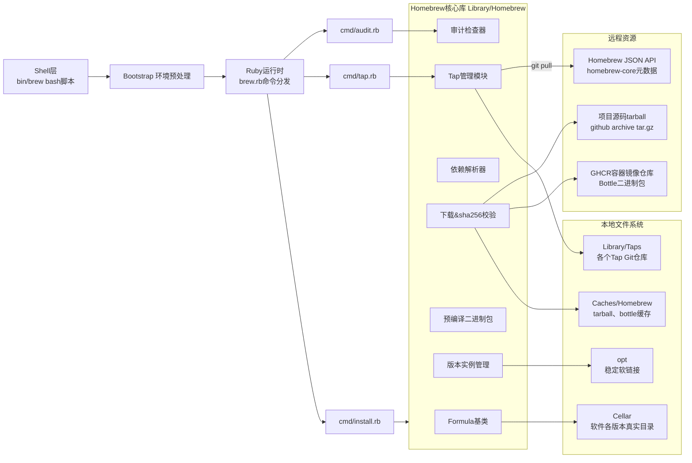
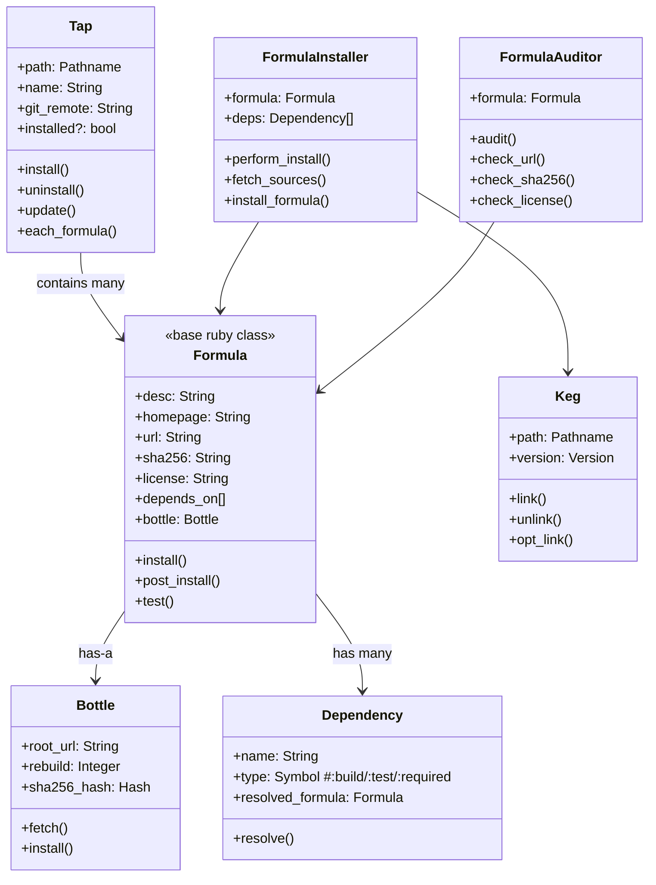
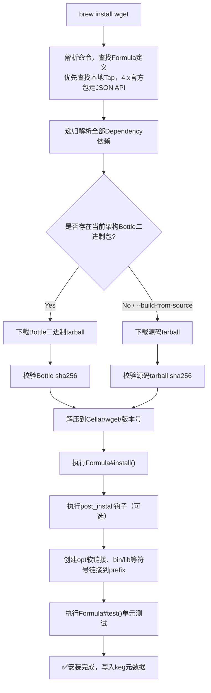

# Homebrew 深度全解析｜macOS/Linux 包管理器底层原理与实战
> 文档版本：v2026‑08，基于 Homebrew 4.x 最新源码，参考官方文档、源码仓库，无编造内容。适合开发者做自定义 Tap、Formula 开发、源码阅读。

## 目录
- [Homebrew 深度全解析｜macOS/Linux 包管理器底层原理与实战](#homebrew-深度全解析macoslinux-包管理器底层原理与实战)
  - [目录](#目录)
  - [1. 简介](#1-简介)
  - [2. 应用场景](#2-应用场景)
  - [3. 整体架构设计 \& Mermaid架构图](#3-整体架构设计--mermaid架构图)
  - [4. 核心术语与目录位置总表](#4-核心术语与目录位置总表)
  - [5. 实现原理：启动链路、核心源码目录](#5-实现原理启动链路核心源码目录)
    - [5.1 三段式启动流程（brew命令执行过程）](#51-三段式启动流程brew命令执行过程)
    - [5.2 源码仓库关键目录（brew仓库）](#52-源码仓库关键目录brew仓库)
  - [6. 全景类图Mermaid](#6-全景类图mermaid)
  - [7. Homebrew 使用的设计模式](#7-homebrew-使用的设计模式)
  - [8. brew install完整工作流程 \& Mermaid流程图](#8-brew-install完整工作流程--mermaid流程图)
  - [9. 关键源码片段解释](#9-关键源码片段解释)
    - [9.1 Formula 标准模板（用户编写的配方，DSL元编程）](#91-formula-标准模板用户编写的配方dsl元编程)
    - [9.2 Tap核心逻辑简述（`tap.rb`）](#92-tap核心逻辑简述taprb)
    - [9.3 audit审计核心逻辑](#93-audit审计核心逻辑)
  - [10. 关键数据参数汇总表](#10-关键数据参数汇总表)
    - [10.1 Formula元数据字段](#101-formula元数据字段)
    - [10.2 高频环境变量](#102-高频环境变量)
    - [10.3 高频命令参数](#103-高频命令参数)
  - [11. 本地模式 vs 远程Tap模式](#11-本地模式-vs-远程tap模式)
    - [本地模式（开发调试自定义Formula）](#本地模式开发调试自定义formula)
    - [远程Tap模式（正式分发）](#远程tap模式正式分发)
  - [12. 常见问题与解决方案](#12-常见问题与解决方案)
  - [13. 最佳实践](#13-最佳实践)
    - [Formula开发最佳实践](#formula开发最佳实践)
    - [用户使用最佳实践](#用户使用最佳实践)
  - [14. Formula/Cask 示例](#14-formulacask-示例)
    - [最小Formula示例](#最小formula示例)
    - [最小Cask示例（GUI应用）](#最小cask示例gui应用)
  - [15. 知名开源第三方 Tap 项目](#15-知名开源第三方-tap-项目)
  - [16. 延伸阅读](#16-延伸阅读)

---

## 1. 简介
Homebrew 是 macOS / Linux 平台的开源包管理器，由 Max Howell 创建，主要用于安装 Apple 系统没有预装的 UNIX 工具、库、CLI 程序、GUI App。

> 核心哲学：**尽可能不使用 sudo，软件安装到独立前缀目录，版本隔离，基于Git + Ruby DSL，安全校验sha256**。

两大包定义体系：
1. **Formula**：源码编译包（命令行工具、库），下载 tarball 源码包，本地编译，或直接下载预编译 Bottle 二进制包。
2. **Cask**：二进制应用包，管理 `.app`、`.dmg`、`.pkg`，直接拷贝应用到 `/Applications`，不需要编译。

> 版本：Homebrew 4.x 重大变化：使用 JSON API 替代本地克隆 homebrew‑core，减少本地磁盘占用；Tap 机制保留不变。

## 2. 应用场景
1. **日常开发环境管理**：安装 wget、git、cmake、openssl、rust、go 等开发工具。
2. **自定义软件分发**：自己开发CLI工具，编写 Formula，搭建私有 Tap，给团队一键安装。
3. **GUI应用快速部署**：`brew install --cask visual‑studio‑code`。
4. **CI/CD流水线**：GitHub Actions 使用 Homebrew 安装依赖。
5. **版本隔离**：多版本共存，例如 `python@3.11`、`python@3.12`，通过 `opt` 软链接切换。
6. **Linuxbrew**：在非debian系Linux上复用同一套包定义。

不适合场景：系统内核模块、需要深度系统权限的驱动程序。

## 3. 整体架构设计 & Mermaid架构图
Homebrew整体分层：
- **Shell入口层**：`bin/brew` bash脚本，环境预处理，引导到Ruby运行时。
- **命令调度层**：Ruby命令分发，处理子命令（install/tap/audit/fetch）。
- **核心业务层**：Formula、Tap、Dependency、Bottle、Keg、Auditor、Downloader。
- **存储层**：Cellar（实际安装文件）、Taps（git仓库源）、Cache（下载缓存）、opt软链接目录。
- **外部依赖**：GitHub API、GHCR镜像仓库（Bottle二进制）、Git、系统clang/gcc编译器。



## 4. 核心术语与目录位置总表
> M系列(Apple Silicon)前缀：`/opt/homebrew`；Intel：`/usr/local`；Linux：`/home/linuxbrew/.linuxbrew`。

| 名词    | 含义                                            | 物理路径                                    |
| ------- | ----------------------------------------------- | ------------------------------------------- |
| Prefix  | Homebrew安装根目录                              | `$(brew --prefix)`                          |
| Formula | 源码包定义，`.rb` Ruby DSL脚本                  | `Library/Taps/*/*/Formula/*.rb`             |
| Tap     | 存放Formula/Cask的Git仓库源                     | `$(brew --repository)/Library/Taps`         |
| Cellar  | 软件真实安装目录（每个版本独立文件夹）          | `${prefix}/Cellar`                          |
| Keg     | Cellar下某一个软件的**单个版本目录**            | `Cellar/wget/1.24.5`                        |
| opt     | 稳定软链接目录，指向当前激活版本                | `${prefix}/opt/*`                           |
| Bottle  | 预编译二进制tarball包，避免本地编译             | 远程GHCR下载，本地缓存`Caches/Homebrew`     |
| Tarball | 源码压缩包（`.tar.gz`），Formula的url指向该资源 | 缓存目录`Caches/Homebrew/downloads`         |
| Cask    | GUI应用包定义                                   | `Library/Taps/homebrew/homebrew‑cask/Casks` |
| Audit   | 静态检查工具，校验Formula语法、链接、license    | 属于Homebrew内部库，无独立目录              |

> 重要：**Tap没有独立数据库文件，Taps目录下存在git仓库 = tap已注册**；删除目录等价于 untap。

## 5. 实现原理：启动链路、核心源码目录
### 5.1 三段式启动流程（brew命令执行过程）
1. **阶段1 bash入口 `bin/brew`**
    - 清理污染的环境变量，检测系统架构，处理`PATH`。
    - 调用 `brew.sh`，选择ruby解释器。
2. **阶段2 bootstrap `brew.sh`**
    - 判断快速命令，部分简单命令直接shell处理；大部分转发ruby。
3. **阶段3 Ruby入口 `brew.rb`**
    - require加载全部Homebrew库，解析子命令，路由到对应cmd脚本。

### 5.2 源码仓库关键目录（brew仓库）
```
brew/
├─ bin/brew                # shell入口脚本
├─ cmd/                    # 各个子命令实现：install.rb tap.rb audit.rb fetch.rb
└─ Library/
    └─ Homebrew/           # 核心ruby库
        ├─ formula.rb      # Formula基类
        ├─ tap.rb          # Tap管理逻辑
        ├─ dependency.rb   # 依赖解析
        ├─ bottle.rb       # Bottle二进制逻辑
        ├─ keg.rb          # Keg版本管理
        ├─ formula_installer.rb # 安装主逻辑
        ├─ download_strategy.rb # tarball下载校验
        └─ formula_auditor.rb    # audit审计实现
```

> 注意：homebrew‑core 是独立git仓库，存放大量官方Formula；4.x版本默认不走本地clone，走HTTP JSON API获取元数据，第三方tap仍然本地git clone到`Library/Taps`。

## 6. 全景类图Mermaid


## 7. Homebrew 使用的设计模式
1. **DSL领域特定语言（元编程）**
Formula继承Ruby基类，通过类方法`desc homepage url sha256 depends_on`做声明式配置，Ruby元编程捕获类调用，存储元数据。这是Homebrew最核心设计。
2. **模板方法模式 Template Method**
`Formula`基类定义生命周期钩子：`install/post_install/test`；用户编写Formula重写这些方法实现自定义逻辑。
3. **策略模式 Strategy**
`DownloadStrategy`：支持github tarball、git head、http多种下载策略，不同源使用不同下载实现。
4. **组合模式 Composite**
依赖解析系统，递归解析`Dependency`树，处理依赖嵌套。
5. **命令模式 Command**
所有子命令（install/tap/audit）统一接口，cmd目录各个脚本实现命令，统一入口分发。
6. **单例模式**：全局配置、系统环境实例。
7. **装饰器模式**：Sorbet类型注解，给Ruby动态语言增加静态类型签名。

> 补充：Ruby动态元编程是整个Formula DSL的根基，所有`.rb`配方本质是继承`Formula`类的Ruby子类。

## 8. brew install完整工作流程 & Mermaid流程图
以 `brew install wget` 为例，完整生命周期：



文字步骤拆解：
1. 定位Formula：从tap仓库或者homebrew jsonAPI读取`.rb`。
2. 依赖解析：递归收集所有`depends_on`，优先安装依赖包。
3. 判断是否有Bottle预编译包；有则直接下载二进制，跳过源码编译。
4. 下载tarball（源码或者bottle包），**校验sha256哈希，如果不匹配直接报错终止（防篡改）**。
5. 解压到Cellar下独立版本目录Keg。
6. 执行`def install`：执行configure/make/cargo等编译命令。
7. 执行post_install后置处理。
8. 创建软链接：`opt/wget`指向当前激活Keg；`bin/wget`链接到prefix/bin。
9. 执行`test`方法做简单冒烟测试。
10. 完成。

> 关键：**每个版本独立Keg目录，多版本共存；opt软链接统一指向当前使用版本**。

## 9. 关键源码片段解释
### 9.1 Formula 标准模板（用户编写的配方，DSL元编程）
```ruby
class Wget < Formula
  # 类方法调用，被父类Formula捕获保存元数据（元编程DSL）
  desc "Internet file retriever"
  homepage "https://www.gnu.org/software/wget/"
  url "https://ftp.gnu.org/gnu/wget/wget‑1.24.5.tar.gz"
  sha256 "fa2dc35bab5184ecbc46a9ef83def2aaaa3f4c9f3c97d4bd19dcb07d4da637de"
  license "GPL‑3.0‑or‑later"

  # 依赖声明
  depends_on "openssl@3"

  # 模板方法：子类重写，实现编译安装逻辑
  def install
    # system：ruby封装，调用shell命令，#{prefix} 指向当前keg目录
    system "./configure", "--prefix=#{prefix}"
    system "make"
    system "make", "install"
  end

  # 可选：安装后测试
  def test
    system "#{bin}/wget", "--version"
  end
end
```
- `#{prefix}`：指向当前Keg目录 `Cellar/wget/1.24.5`，所有产物安装到此目录，不污染系统其他位置。
- `#{bin}`：`prefix/bin`。

### 9.2 Tap核心逻辑简述（`tap.rb`）
```ruby
# 伪代码，还原源码逻辑
class Tap
  def install
    # git clone远端仓库到 Library/Taps/username/repo
    git.clone(@remote, path)
  end

  def update
    # 进入目录执行git pull
    git.cd(path) { git.pull }
  end

  def formula_paths
    Dir.glob("#{path}/Formula/*.rb")
  end
end
```
> tap本质就是管理本地git仓库；`brew tap xxx/yyy git_url`就是clone；`brew untap`就是删除文件夹。

### 9.3 audit审计核心逻辑
`FormulaAuditor`加载Formula实例，执行：
1. 静态检查字段完整性（desc/homepage/url/sha256/license）。
2. http探测homepage、url是否可访问。
3. 检查install脚本是否存在不安全硬编码路径。
4. 输出warning/error。

## 10. 关键数据参数汇总表
### 10.1 Formula元数据字段
| 字段          | 必须 | 说明                                                    |
| ------------- | ---- | ------------------------------------------------------- |
| desc          | ✅    | 简短软件描述                                            |
| homepage      | ✅    | 项目主页url，audit会检测连通性                          |
| url           | ✅    | 源码tarball下载地址，github archive tar.gz常用          |
| sha256        | ✅    | tarball压缩包的sha256指纹，**是压缩包不是解压后的文件** |
| license       | ✅    | 开源许可证                                              |
| depends_on    | ❌    | 依赖声明，`:build`编译时依赖，`:test`测试依赖           |
| bottle do…end | ❌    | 预编译二进制包元数据，官方core自动生成                  |
| head          | ❌    | git开发分支，brew install --head使用                    |

### 10.2 高频环境变量
| 环境变量                    | 作用                              |
| --------------------------- | --------------------------------- |
| `HOMEBREW_NO_AUTO_UPDATE=1` | 关闭brew install自动update        |
| `HOMEBREW_NO_TUI=1`         | 关闭TUI交互式终端界面，纯文本输出 |
| `HOMEBREW_CACHE`            | 自定义下载缓存目录                |
| `HOMEBREW_PREFIX`           | 自定义Homebrew安装前缀            |

### 10.3 高频命令参数
| 命令参数                          | 含义                                    |
| --------------------------------- | --------------------------------------- |
| `--build‑from‑source`             | 放弃bottle，强制本地编译tarball源码     |
| `brew fetch --sha256 url`         | 下载tarball，输出sha256，不保存本地文件 |
| `brew audit --new‑formula xxx.rb` | 严格模式，用于提交新Formula到官方源     |
| `brew reinstall`                  | 卸载后重新安装                          |
| `brew update tapname/taprepo`     | 只更新指定tap的git仓库，不更新全部      |
| `brew untap username/repo`        | 删除第三方tap源                         |

## 11. 本地模式 vs 远程Tap模式
### 本地模式（开发调试自定义Formula）
```bash
brew install --build‑from‑source ./swiftdiagram.rb
```
- 直接读取本地磁盘rb文件，**不需要tap**。
- 适合开发调试，修改rb直接重新install。
- 缺点：不能给其他机器分发。

### 远程Tap模式（正式分发）
```bash
brew tap LongXiangGuo/SwiftDiagram https://github.com/LongXiangGuo/SwiftDiagram.git
brew install LongXiangGuo/SwiftDiagram/swiftdiagram
```
1. 将`.rb`放到git仓库下`Formula/xxx.rb`。
2. brew tap把git仓库clone到本地`Library/Taps`。
3. 用户只需要tap+install，完成分发。

> ⚠️注意：tap仓库推荐命名规范 `homebrew‑xxx`；如果仓库名不遵循规范，需要传入第二个git url参数强制指定。

> 重要坑：**tap不会自动git pull，修改远端rb之后，本机必须执行`brew update user/tap`才会拉取最新配方**。

## 12. 常见问题与解决方案
| 问题现象                                  | 根因                                                   | 解决方案                                                                                   |
| ----------------------------------------- | ------------------------------------------------------ | ------------------------------------------------------------------------------------------ |
| `sha256 does not match`                   | tarball内容发生变化，sha指纹失效                       | 重新执行`brew fetch --sha256 <url>`获取新哈希填入Formula；禁止git tag‑f强制覆盖release tag |
| `No available formula`                    | tap没有添加成功；或者Formula没有放在仓库`Formula/`目录 | 确认tap列表`brew tap`；检查仓库目录结构必须存在`Formula/xxx.rb`                            |
| brew audit报homepage不可访问              | 网络/代理问题，github访问失败                          | 检查网络，可临时关闭网络审计，正式提交必须修复                                             |
| 安装成功，终端找不到命令                  | 没有link；PATH没有加入`$HOMEBREW_PREFIX/bin`           | `brew link xxx`；检查shell环境PATH配置                                                     |
| tap远端修改rb，本机brew install还是旧版本 | tap本地git仓库没有pull更新                             | `brew update username/tapname`                                                             |
| Intel/M1跨架构bottle找不到                | 没有对应架构预编译包                                   | 增加`--build‑from‑source`本地编译源码                                                      |
| brew执行非常慢                            | ruby启动慢，tap数量过多，网络超时                      | 设置`HOMEBREW_NO_AUTO_UPDATE=1`；检查代理；清理无用tap                                     |

> 高危提醒：**禁止使用`git tag -f`强制覆盖已经发布的tag**，github archive tar.gz会改变，sha256全部失效，所有用户安装报错。

## 13. 最佳实践
### Formula开发最佳实践
1. tarball优先使用github tag archive地址：`https://github.com/xxx/xxx/archive/refs/tags/v1.0.0.tar.gz`。
2. sha256必须使用`brew fetch --sha256`从远端下载计算，不要本地git archive生成tar算哈希（元数据时间戳差异，sha不一致）。
3. 正式发布tag禁止`‑f`强制覆盖tag。
4. 编写完Formula后，执行两步校验：
    ```bash
    brew audit --new‑formula ./xxx.rb
    brew install --build‑from‑source ./xxx.rb
    ```
5. tap仓库目录严格：根目录下`Formula/xxx.rb`，不要直接丢根目录。
6. license字段必须填写，audit强制校验。

### 用户使用最佳实践
1. 尽量使用bottle二进制包，减少本地编译耗时。
2. 第三方tap只添加信任的开源仓库，tap执行的ruby脚本拥有用户权限，存在供应链风险。
3. 定期执行`brew cleanup`清理旧版本keg和缓存。
4. CI流水线中使用`HOMEBREW_NO_AUTO_UPDATE=1`关闭自动更新，加速构建。

## 14. Formula/Cask 示例
### 最小Formula示例
```ruby
class Swiftdiagram < Formula
  desc "Generate PlantUML class diagrams from Swift source code with a local web console"
  homepage "https://github.com/LongXiangGuo/SwiftDiagram"
  url "https://github.com/LongXiangGuo/SwiftDiagram/archive/refs/tags/v1.0.0.tar.gz"
  sha256 "79e90f0dd65f57091ea47e13f994fd9baf69e3291498735482666f6f9aa475fe"
  license "MIT"

  depends_on :macos
  depends_on xcode: ["13.0"]
$$
  def install
    # --disable-sandbox: SwiftPM 需要在构建期拉取 SPM 依赖（SourceKitten 等）
    system "swift", "build", "-c", "release", "--disable-sandbox", "--product", "swiftclassdiagram"
    bin.install ".build/release/swiftclassdiagram"
  end

  test do
    assert_match "1.0.0", shell_output("#{bin}/swiftclassdiagram version")
  end
end
```

### 最小Cask示例（GUI应用）
```ruby
cask "myapp" do
  version "1.0.0"
  sha256 "xxxx"
  url "https://xxx/myapp‑1.0.0.dmg"
  homepage "https://github.com/xxx/myapp"
  app "MyApp.app"
end
```

## 15. 知名开源第三方 Tap 项目
参考官方Interesting‑Taps文档
1. `homebrew‑ffmpeg/ffmpeg`：带更多编码选项的ffmpeg tap。
2. `denji/nginx`：多模块nginx完整版本。
3. AWS官方tap：提供aws cli工具集合。
4. `TwoWells/homebrew‑tap`：典型的团队私有CLI分发tap模板，GitHub Actions自动bump版本。
5. `launchdarkly/homebrew‑tap`：企业级CLI工具官方tap，生产环境参考模板。

> 开发自己tap可以直接参考TwoWells/homebrew‑tap仓库的CI自动化脚本，实现tag发布自动更新Formula版本与sha256。

## 16. 延伸阅读
- Homebrew官方文档：https://docs.brew.sh/
- Formula Cookbook：https://docs.brew.sh/Formula‑Cookbook
- Homebrew源码仓库：https://github.com/Homebrew/brew
- Interesting Taps：https://docs.brew.sh/Interesting‑Taps‑and‑Forks